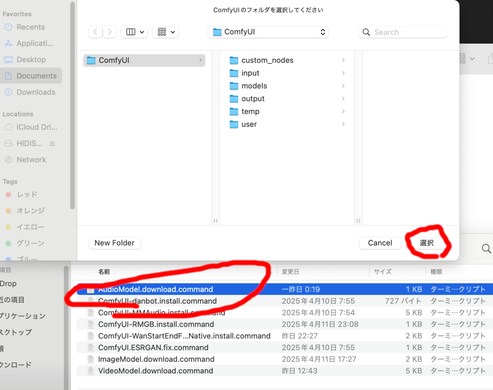
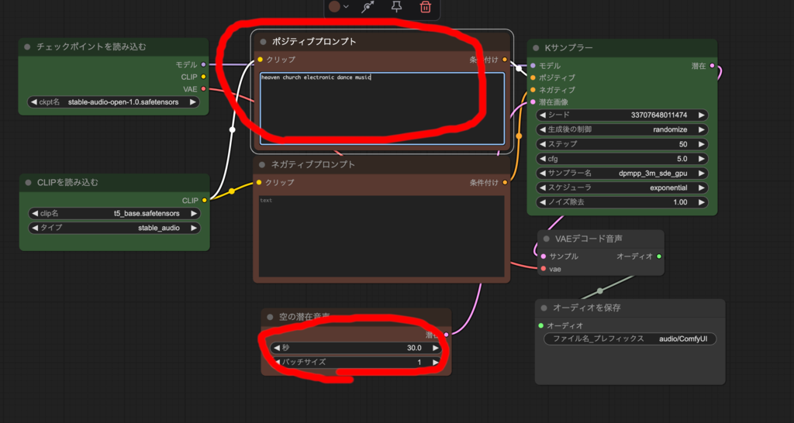
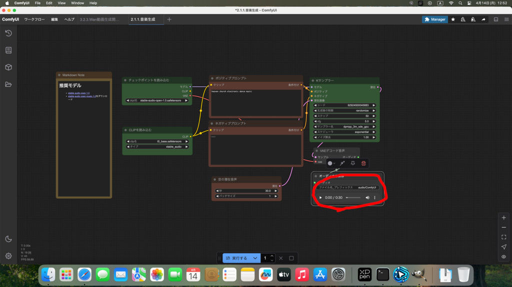
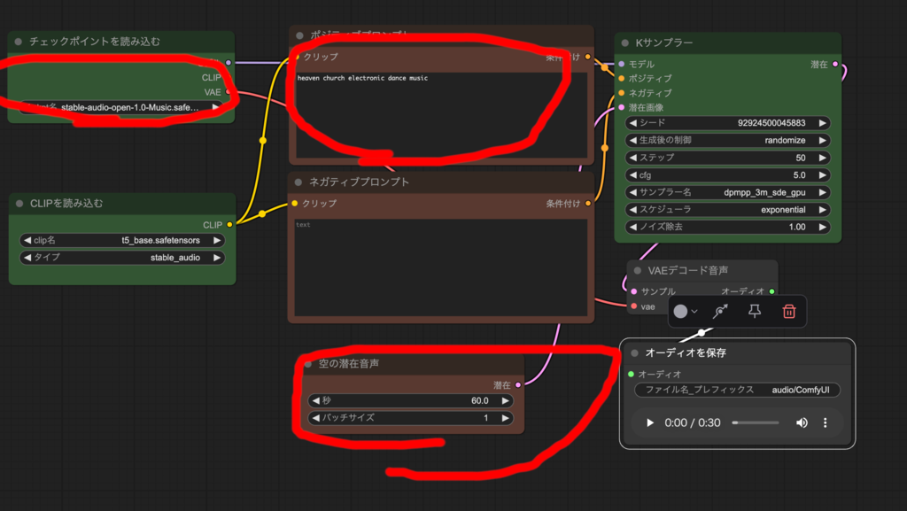

## 音楽生成AI

音楽生成 AI では画像生成 AI と同じ ComfyUI Desktop を利用します。
まだインストールしていない場合は、[画像生成のインストール](image-install.md)
に従って、ComfyUI Desktop をインストールしてください。

## 推奨モデルのダウンロード
ComfyUI Desktop を起動している場合は、一旦終了してください。

catAITools の ComfyUI用ツールの中に『AudioModel.download.command』を用意しました。



これをダブルクリックして、ComfyUIフォルダを指定すれば
推奨モデルがダウンロードされます。

『stable-audio-open-1.0.safetensors』と
その追加学習版『stable-audio-open-1.0-Music.safetensors』の２つのモデルをダウンロードします。

ダウンロード完了したらダイアログが表示されるので OK を押し、さらにターミナルも閉じてください。

## 音楽生成
『2.1.1.音楽生成.json』を開いてください。



上のメニューの編集からノード定義を更新するを押してダウンロードしたモデルを反映させてください。

Stable audio での音楽生成は画像生成と基本的には同じです。

ポジティブプロンプトに生成したい音楽の内容を英語プロンプトで指定します。
次のプロンプトを入力して、実行するを押してください。

```
heaven church electronic dance music
```

30秒間の天国の教会のエレクトロニックダンス音楽が生成されます。




右下のオーディオを保存から再生できます。
また、音声ファイルは output フォルダの audio フォルダ以下に保存されます。


『空の潜在音声』ノードの秒で時間指定できます。

次のプロンプトを入れて、秒を3秒にして実行するを押してください。
```
car engine
```

効果音を生成することもできます。


オリジナルの『stable-audio-open-1.0.safetensors』は著作権のある楽曲を
学習していないようですが、『stable-audio-open-1.0-Music.safetensors』
モデルの方は既存の曲を追加学習したものです。両方試してみてください。



『チェックポイントを読み込む』ノードで
stable-audio-open-1.0-Music.safetensors
に変更し、秒数を 60 秒にして次のプロンプトを入れて実行するを押してください。

```
heaven church electronic dance music
```


## 音楽生成用プロンプトの参考サイト

- [音楽生成AI Stable Audioのプロンプトに使えそうな単語まとめ](https://zakozakocreator.com/stable-audio-prompt/)

こちらのサイトに音楽生成に使えそうな単語がまとめられています。
