### コントロールネットによる生成画像の制御

I2I は画像を直接参照して別な画像を生成しますが、画像から特徴や
構図など画像の構成要素を抽出して別な画像を生成することもできます。
コントロールネットといいます。

より求める画像に近いものを生成できるようになるはずです。

が、使用しているモデルの問題か、いまいち適切に反映されていないような気がします。
また、コントロールネットを使用しない時よりかなり生成時間が増えます。

ただ、こういう技術が理解できるようにするためにワークフローと解説を用意しました。

ここからは標準のノードだけでなくカスタムノードも活用していくので、
指示に従ってカスタムノードをインストールしてください。

### 落書きを元に生成

お絵描きソフトを使って元となる落書きや線画を描いてください。
こちらでは Gimp を使いましたが、何で描いても OK です。

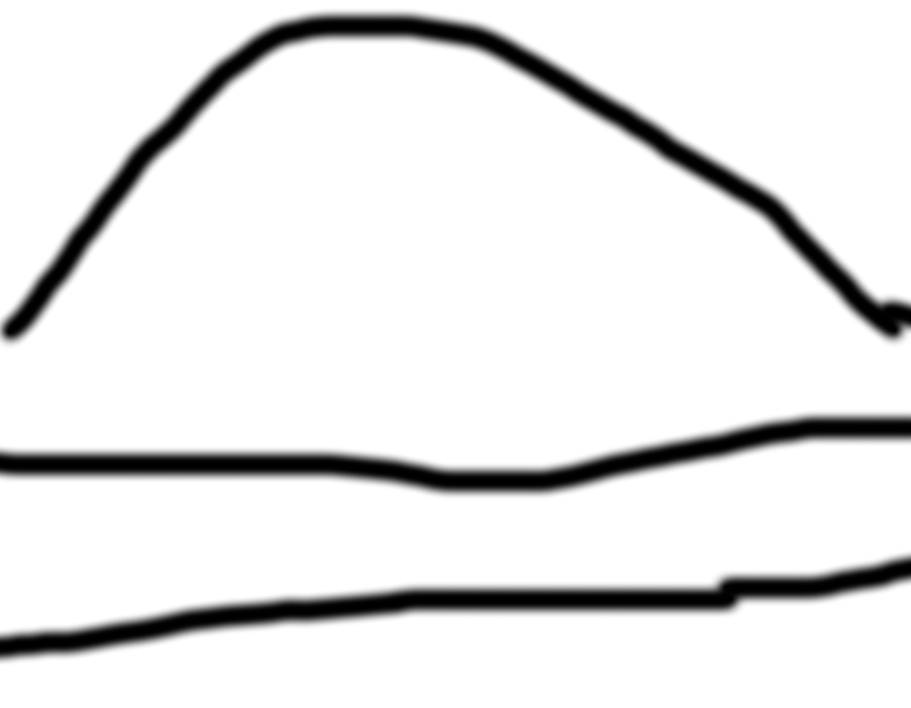

(山と川のつもりです)

この画像は catAITools フォルダの data フォルダに 01.png として入れてあります。

『1.3.1.画像生成コントロールネット落書き.json』を開いてください。

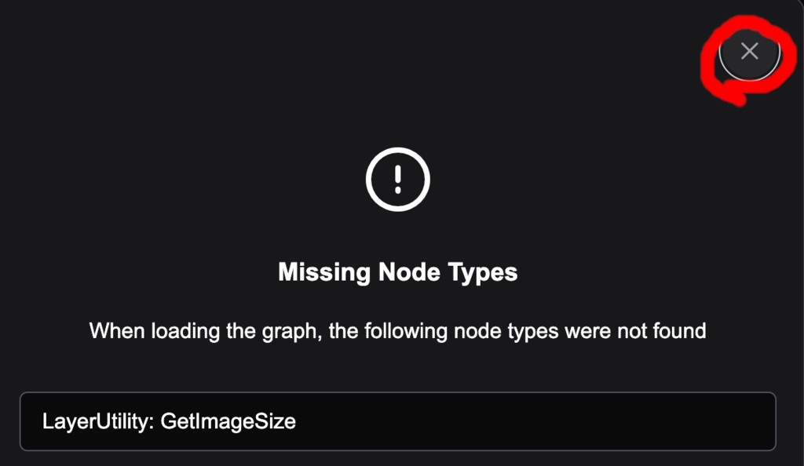

必要なカスタムノードがインストールされていないので警告がでます。
LayerUtility カスタムノードが必要なので ComfyUI-Manager 経由で
インストールします。


警告の右上の×を押して、右上の Manager を押します。

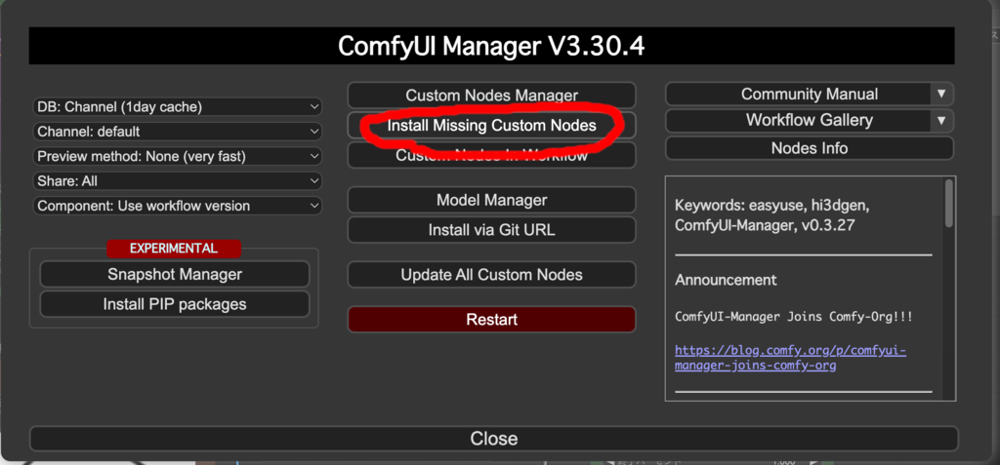

中央上から 2 番目の Install Missing Custom Nodes を押します。

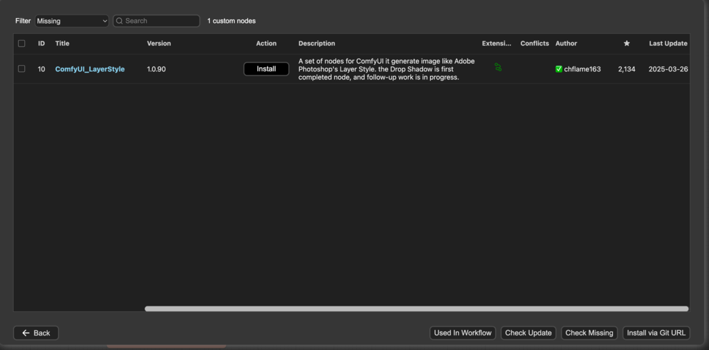

ComfyUI-LayerStyleというカスタムノードが必要なのでInstallを押してください。

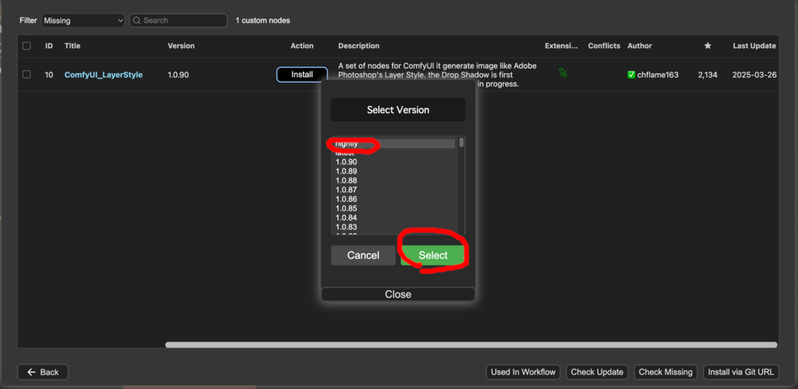

バージョンはnightlyにしてください。Selectを押してインストールします。

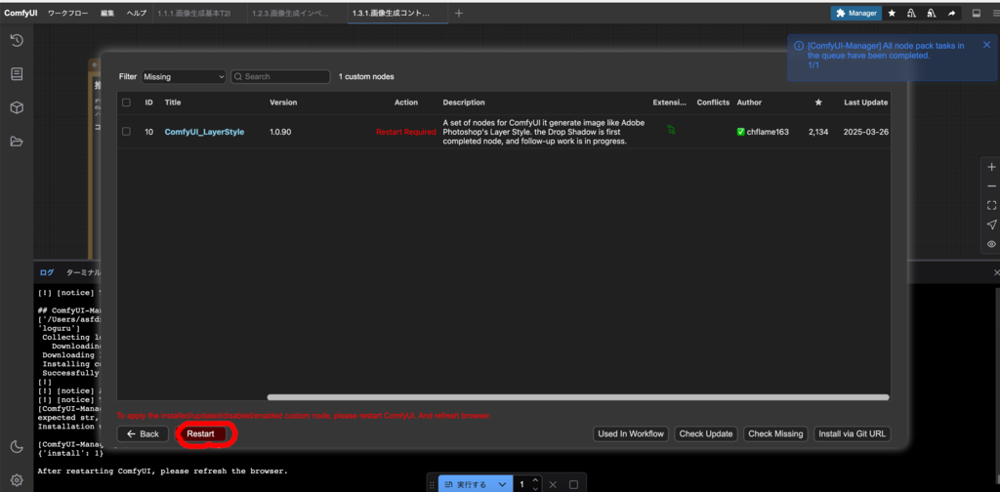

しばらくするとインストールが終わるので、Restartを押してください。


ComfyUI Desktopが再起動され、ワークフローが正常に開かれるはずです。

なお、使用しているカスタムノードは、元となる画像の幅と高さを取得して
『空の潜在画像』ノードに送るためのものです。

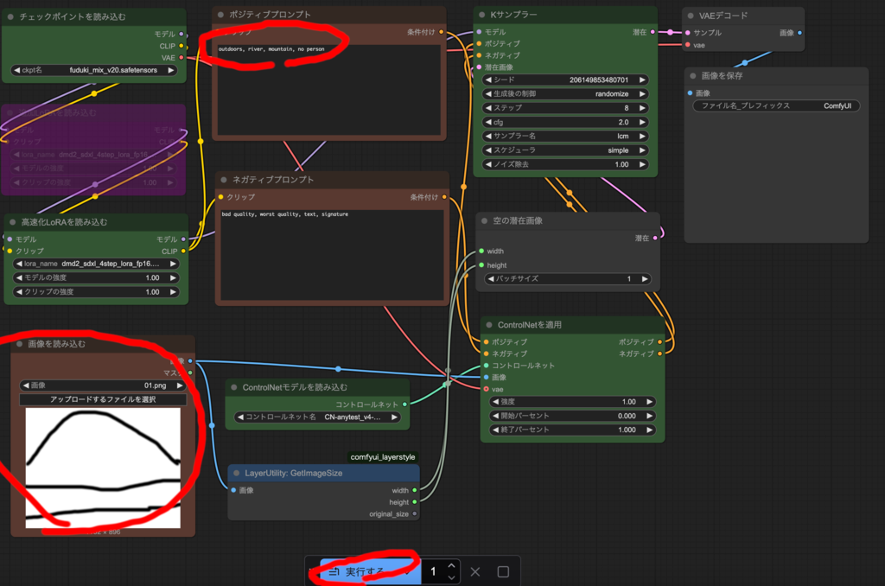

『画像を読み込む』ノードで元となる落書き画像をアップロードし、
ポジティブプロンプトに次の文を入れて実行するを押してください。

```
outdoors, river, mountain, sky, tree, no person
```

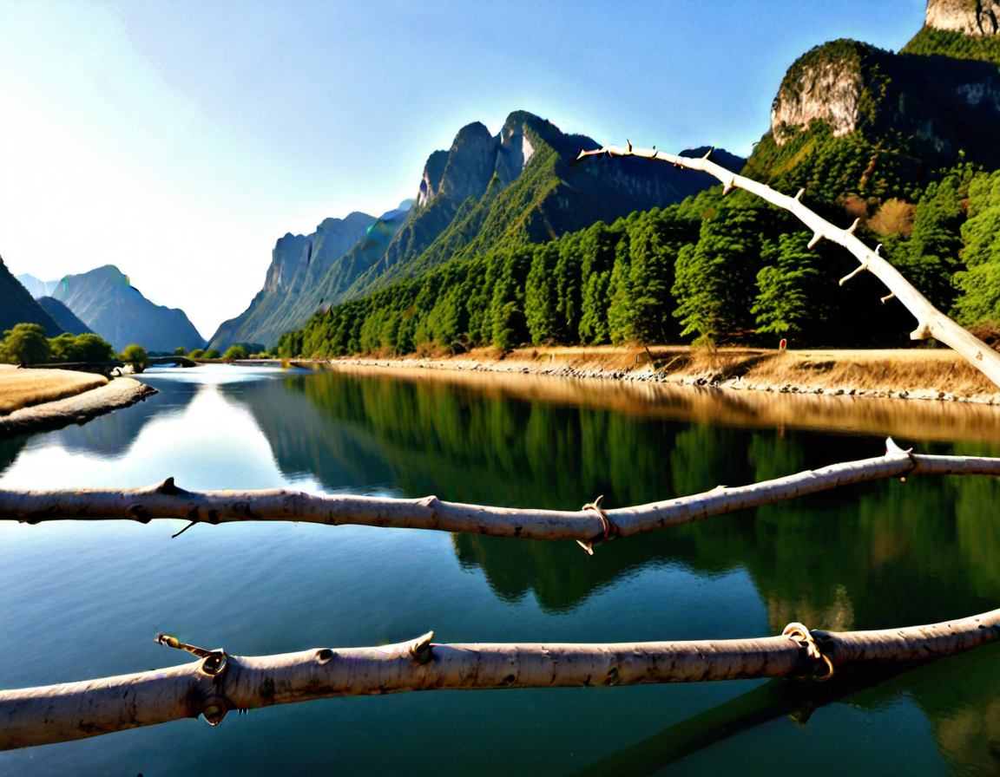

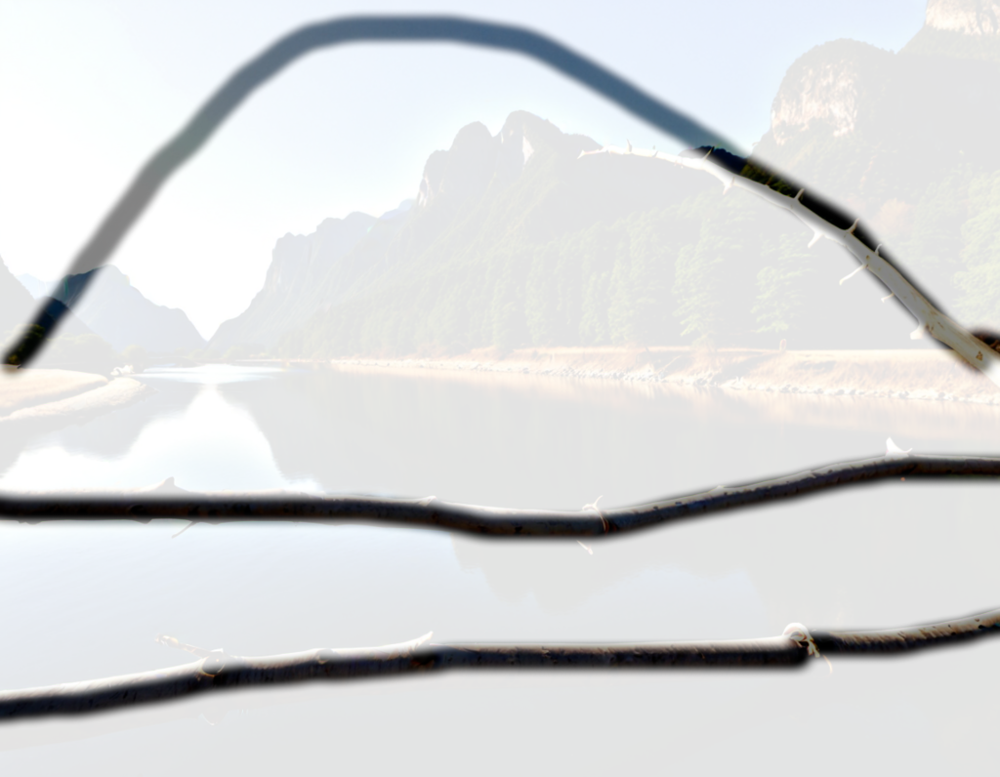

山のつもりの線の一部が枝になり、川のつもりの 2 本の線が 2 本の枝に
なってしまっているので、あまりうまくいっていませんが、
元の落書きの線を反映した画像が生成できています。

### 深度情報
元の画像からどれくらいの距離かを濃淡で表す深度情報をAIから
取得して、生成画像に反映することが可能です。

『1.3.2.画像生成コントロールネット深度情報I2I.json』を開いてください。

DownloadAndLoadDepthAnythingV2Model と DepthAnything_V2 という
カスタムノードが必要です。深度モデルを読み込むノードと、そのモデルを
利用して深度情報を生成するノードです。

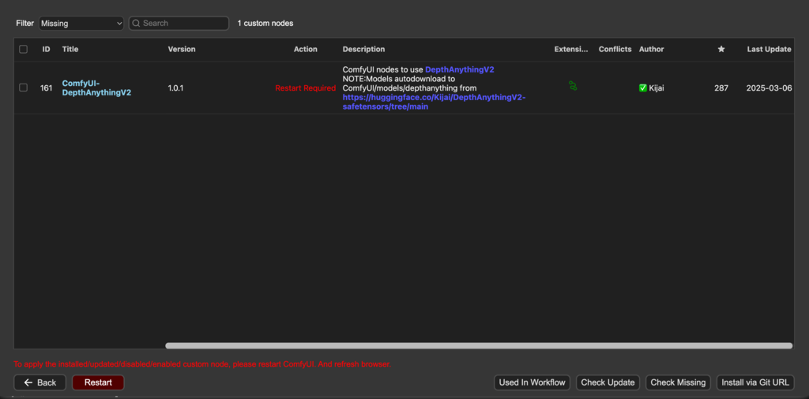

先ほどと同様に ComfyUI_Manager で Install Missiong Nodeから
ComfyUI-DepthAnythingV2 をインストールしてして Restart を押して、
ComfyUI Desktop を再起動してください。

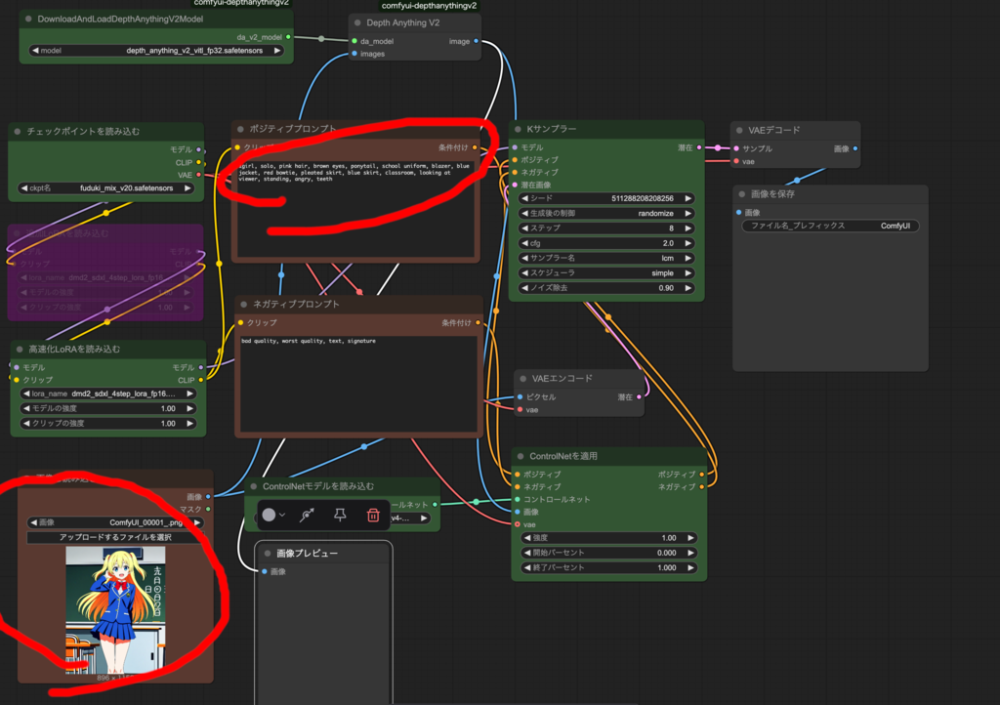

『画像を読み込む』ノードで、生成した少女画像を選び、
ポジティブプロンプトに次の文を入れて実行するを押してください。

```
1girl, solo, pink hair, brown eyes, ponytail, school uniform, 
blazer, blue jacket, red bowtie, pleated skirt, blue skirt, 
classroom, looking at viewer, standing, angry, teeth, official art, 
anime coloring
```

最初に深度情報生成用のモデルをダウンロードするので、初回実行時は
時間がかかります。

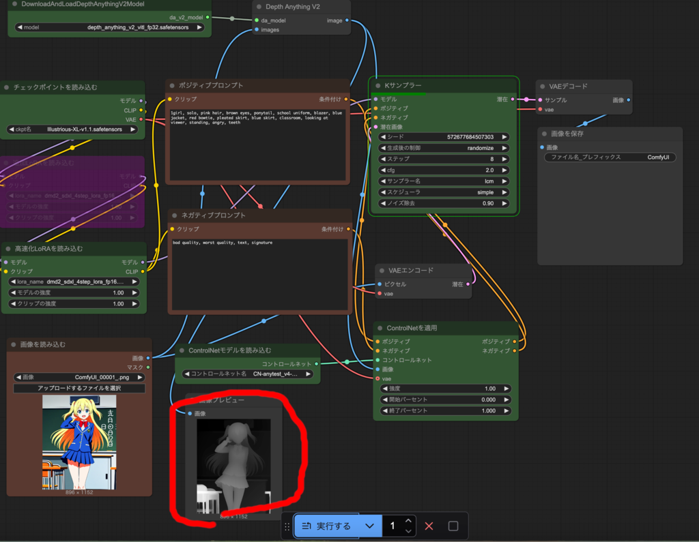

最初に生成された深度情報が下の『画像プレビュー』ノードの方に表示されます。

しばらくすると画像が生成されるはずです。

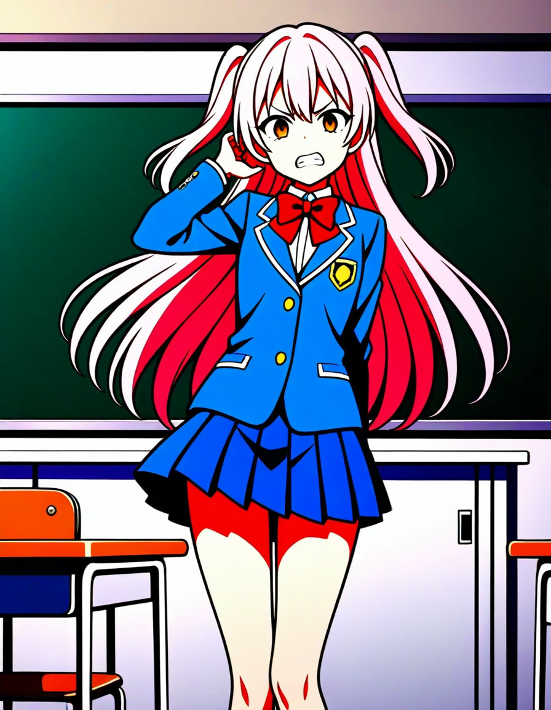

深度情報と元の画像の両方に基づき、元の画像の構図をある程度維持したまま、
プロンプトの内容であるピンク髪茶色目ポニーテール少女が怒っている画像を
生成できているはずです(髪型は元の画像の深度情報の影響を受けて
ツインテールのままになっています)。

『1.3.4.画像生成コントロールネット深度情報T2I.json』を開いてください。

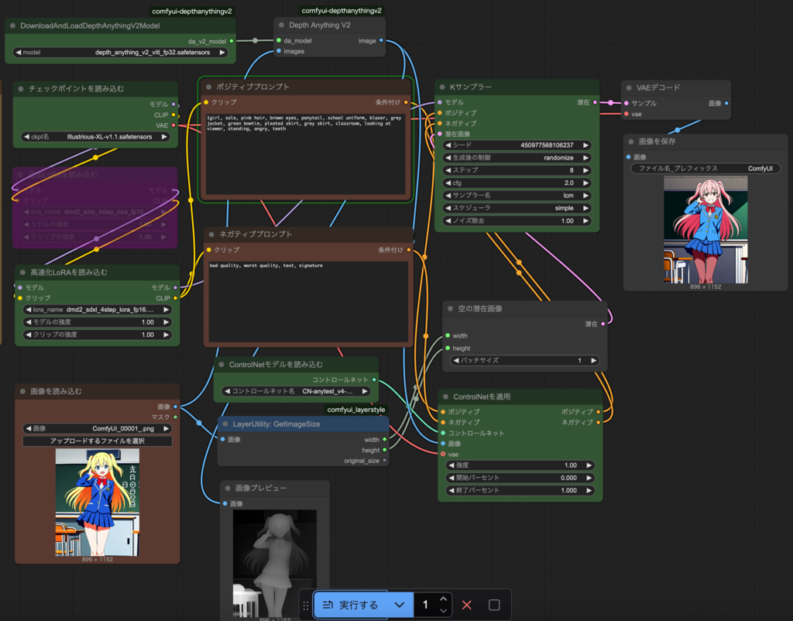

こちらはT2Iなので、元の画像そのものは参照せず、プロンプトと元画像の
深度情報のみに基づき画像を生成します。

次のプロンプトで生成してみてください。
```
1girl, solo, pink hair, brown eyes, ponytail, school uniform, blazer, 
grey jacket, green bowtie, pleated skirt, grey skirt, classroom, 
looking at viewer, standing, angry, teeth
```

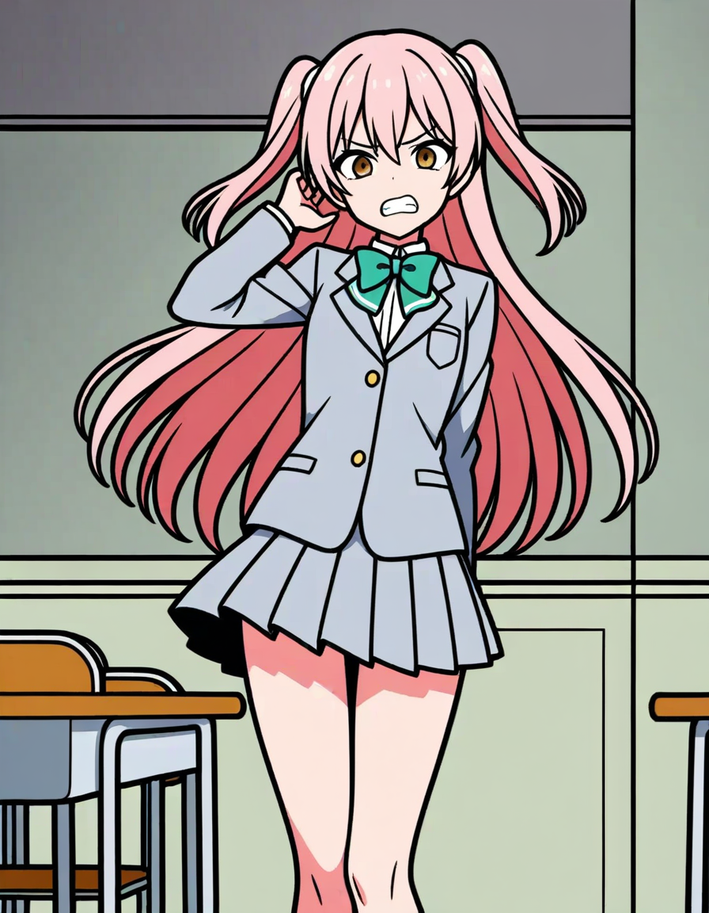

元の画像の深度情報に基づく人物の輪郭や左下の机と椅子の輪郭はきちんと
反映され、 それ以外はプロンプトに基づく画像になっているはずです。

生成したいことに合わせて I2I と T2I を使い分けてください。

### OpenPose
ポーズエディタでポーズを指定して画像を生成することもできます。

### 注意事項
ポーズの指定方法は一般的な 3D モデリングソフトと同じですが、
3D ソフトを使ったことがない人は操作方法がわかりにくいかもしれません。
また、このカスタムノードはあまり安定していないので、誤動作しやすいです。

『1.3.4.画像生成コントロールネットOpenPoseT2I.json』を開いてください。

Hina.PoseEditor3D ノードが必要なので、同様に ComfyUI-Manager から
ComfyUI 3D Pose Editor をインストールして、Restart を押して
 ComfyUI Desktop を再起動してください。OpenPose 形式でポースを
編集するノードです。

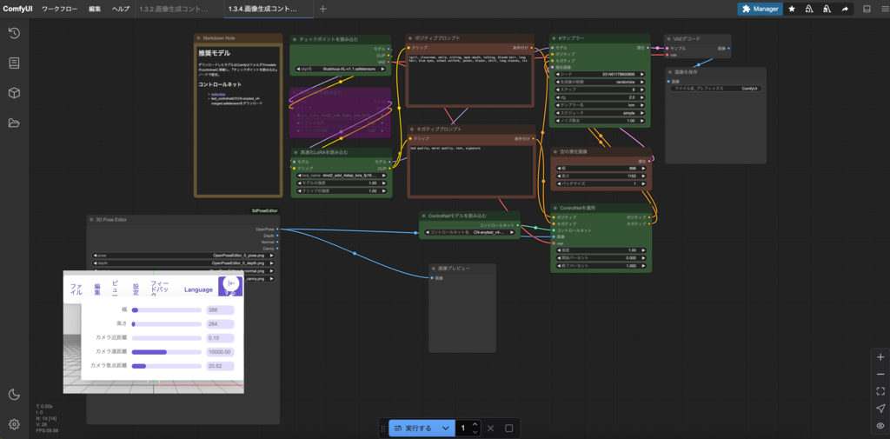

左下の 3D Pose Editor ノードを拡大します。ノードの右端をドラッグしてください。

幅を 896、高さを 1152 にします。
マウスの左ボタンを押しながら移動することで右向きにし、ホイールを回して
拡大し、右ボタンを押しながら移動することで、上半身だけにしてください。
さらに設定の移動モードを選んで、手や足の丸を摘んで移動させて、
移動モードをもう一度押して回転モードにして、次のようにしてください。


これで右向きで両手を前に出した構図で画像を生成できます。

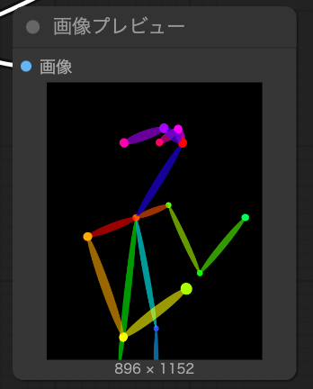

次のプロンプトで生成してみてください。

```
1girl, solo, black hair, brown hair, long hair, school uniform, blazer, 
blue jacket, red bowtie, classroom, smile, open mouth, profile, 
looking to the side, official art, anime coloring
```

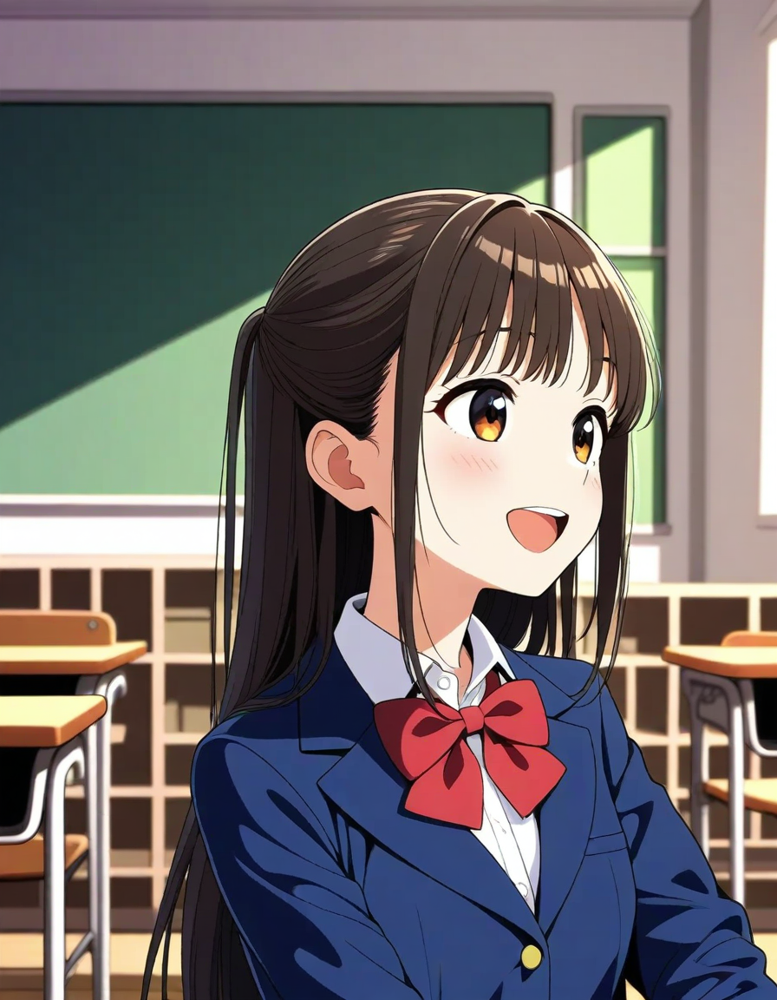

いまいち反映されていない気がしますが、ある程度は制御できている気がします。

右下の ControlNet の適用ノードの強度を変更することでどれくらいポーズを
反映するか指定できます。

3D Pose Editor のメニューのファイルの画像から検出を選ぶと
画像からポーズを検出することもできます。ただし、写真や
リアル調の画像のみ対応しています。

OpenPose 形式でポーズ指定できるポーズエディタは他にもあるので
（[こちらが本家](https://github.com/CMU-Perceptual-Computing-Lab/openpose))
、別途ポーズを作成して、
『1.3.1.画像生成コントロールネット落書き.json』ワークフローで
ポーズ画像を読み込ませて画像生成することも可能です。

文章だけで構図を指定するのは難しいので、線画や既存の画像の深度情報や
OpenPose 等で構図を反映できれば、より望んだ画像を生成しやすくなると思います。
