### 画像拡大

#### ESRGANコードの修正
画像の拡大に ESRGAN というAI技術を使います。

ただ、ComfyUI Desktop がインストールする PyTorch 関連にはバグがあり
macOS では ESRGAN 関連が正常に
動作しません。修正するユーティリティを用意しました。

一旦 ComfyUI Desktop を閉じてください。

catAIToolsフォルダのComfyUI用ツールフォルダを開いてください。

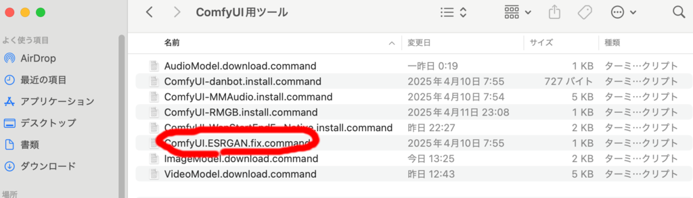

中にある『ComfyUI.ESRGAN.fix.command』をダブルクリックしてください。

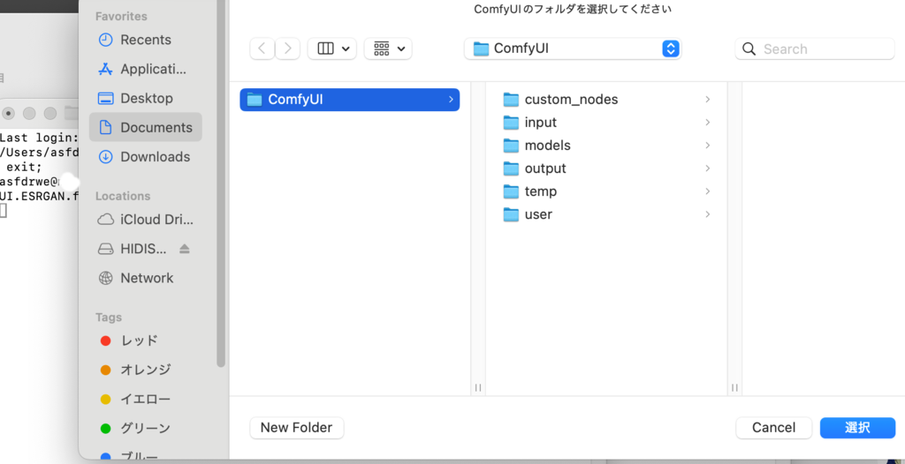

ComfyUI のインストールフォルダを選び、『選択』を押せばコード修正が
適用されます。ツールによって開かれたターミナルは閉じてください。

もう一度 ComfyUI を起動してください。

#### 画像拡大の実行

『1.4.1.画像2倍拡大.json』を開いてください
(ノードが見当たらない場合は右下のメニューの□を押してください）。

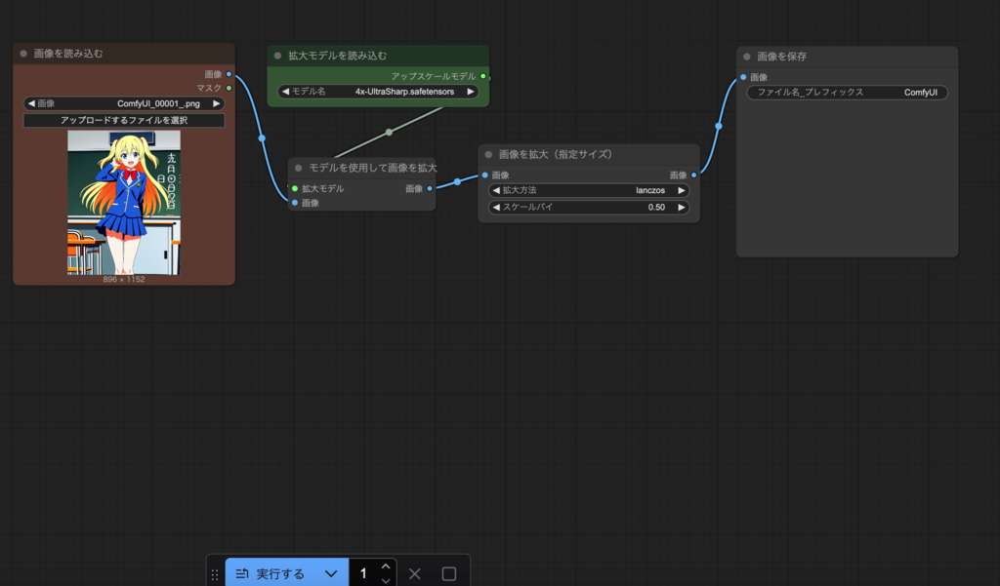

『画像を読み込む』ノードで拡大する画像を選んでください。

一旦 ESRGAN技術で 4 倍にしてから lanczos アルゴリズムで半分に縮小することで、
細部への描写を反映させつつ2倍に拡大できます。

### 背景削除
AIが背景を認識して背景を削除しその部分を透過にしたり
クロマキー用緑や青にできます。

RMBG カスタムノードが必要です。が、カスタムノードの requirements.txt が
macOS を考慮していないのでそのままではインストールできません。

インストールできるよう修正してインストールするスクリプトを用意したので、
ComfyUI Desktop を一旦終了させください。

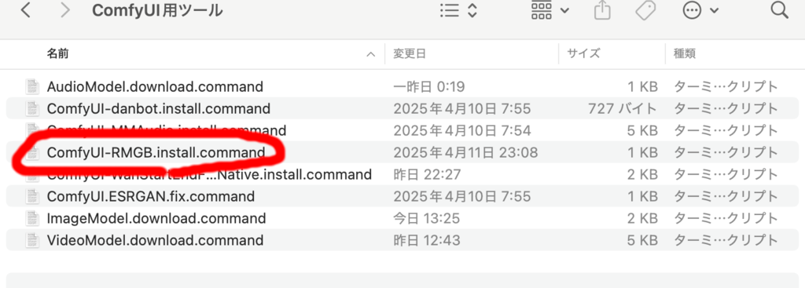

catAITools フォルダのの ComfyUI用ツール フォルダの
『ComfyUI-RMBG.install.command』をダブルクリックしてください。

ComfyUI のインストールフォルダを選び、選択を押せばコード修正が
適用されます。ターミナルは閉じてください。

もう一度 ComfyUI を起動してください。

『1.4.3.画像背景除去.json』を開いてください。

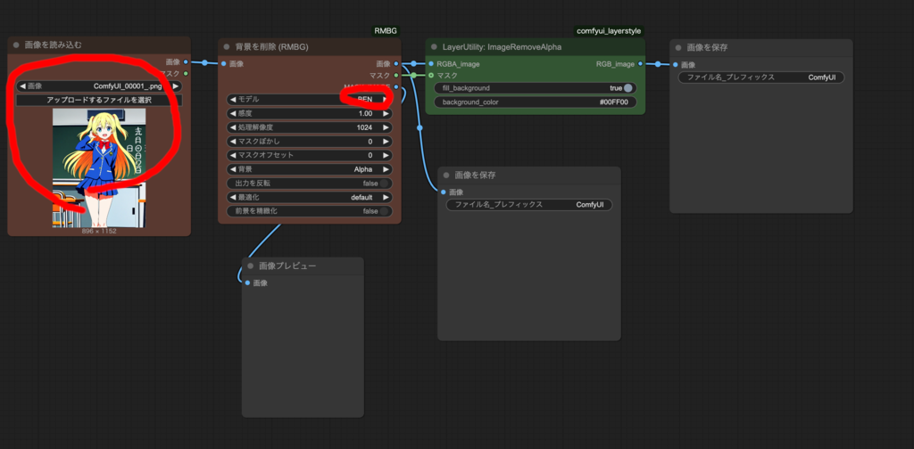

『画像を読み込む』ノードで画像を選択してください。

実行するを押せば、モデルが自動的にダウンロードされ、
背景を自動で削除して透過にしたものとグリーンバックにしたものが
生成されるはずです。

『背景を削除（RMBG)』ノードのモデルには BEN、BEN2、INSPYRENET、RMGB-2.0 の
4 種類とあり、どれが一番うまくいくかはやってみたいとわからないので、
いまいちの場合は別なモデルで試してみてください。

- BEN 背景切り抜きミスがある上に足の一部が切り抜かれれています。

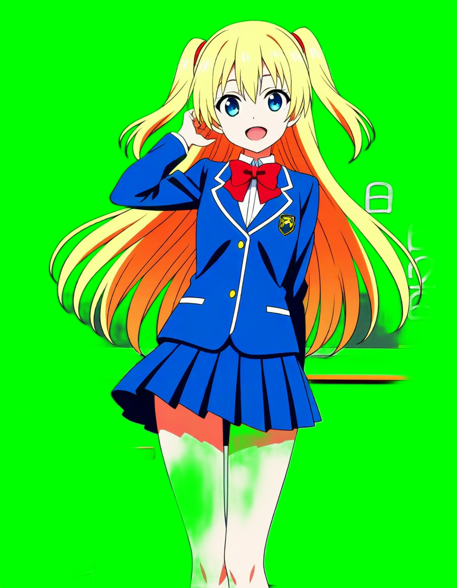

- BEN2 背景切り抜きミスがあります。

- INSPYRENET ごくわずかに背景切り抜きミスがあります。

- RMBG-2.0 問題ないようです。

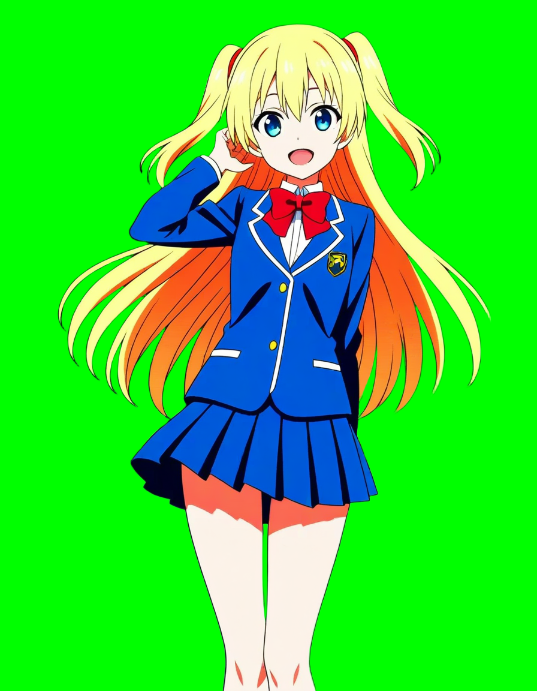

『LayerUtility:ImageRemoveAlpha』ノードの background_color で
背景色を変えられます。'#00FF00' の場合グリーンバックに、
'#0000FF' の場合ブルーバックになります。

### 背景合成
さらに削除した背景部分に別な背景を差し込むこともできます。

『1.4.5.画像背景合成.json』を開いてください。

『画像を読み込む』ノードで背景を削除して前景にする画像を読み込み、
『背景画像を読み込む』ノードで背景とする画像を読み込んでください。
『背景を削除（RMBG)』ノードのモデルを RMBG-2.0 にしてください。
前景画像を背景画像の中央に配置するために『画像コンビネーション（RMBG)』
ノードの位置Xと位置Yは 50 にしてください。

実行するを押せば前景画像の背景が削除され背景画像が埋め込まれるはずです。

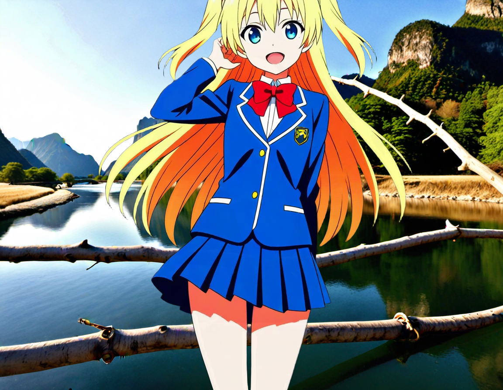

### ステレオ画像生成

『1.4.7.ステレオ画像化.json』を開いてください。

StereoImageNode カスタムノードが必要なので、ComfyUI-Manager で
インストールして、ComfyUI Desktop を再起動してください。

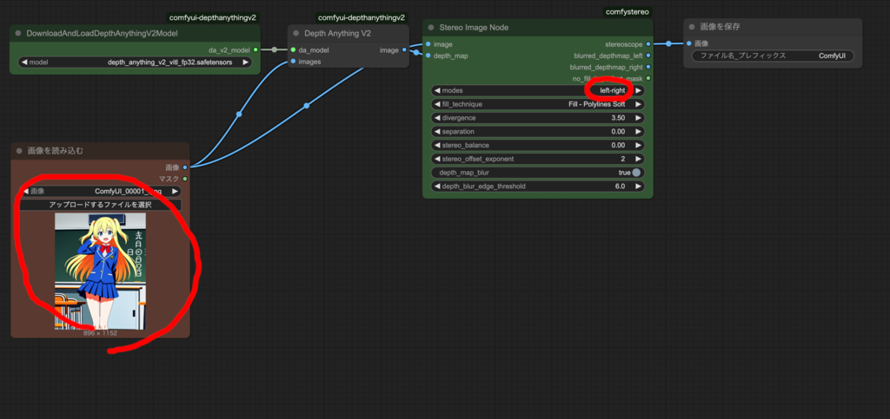

『Stereo Image Node』ノード の modes を left-right にして実行するを押すと
深度情報に基づき LR 形式のステレオ画像が生成されます。

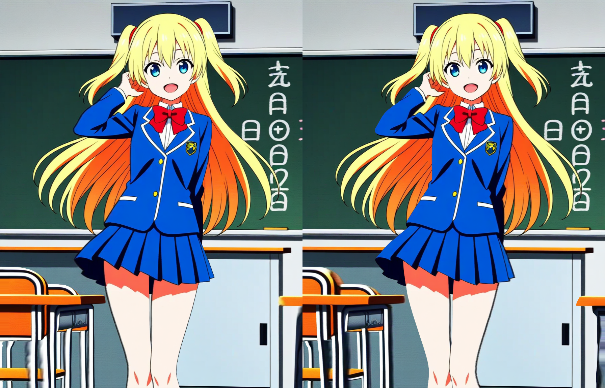

VR ビューアで見れば立体視できるはずです。

『Stereo Image Node』ノード の modes を right-left にすれば
RL 形式（交差法用)の画像を生成することもできます。
交差法での立体視は慣れれば裸眼で可能なのでお試しください
(参考: [交差法での立体視の解説](https://www.stereoeye.jp/howto/cross.html))。

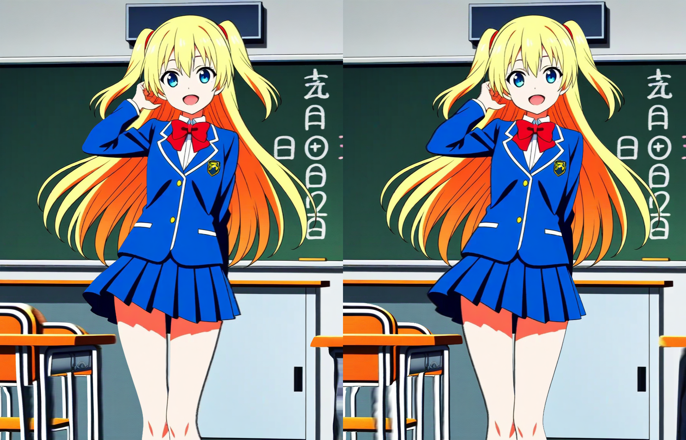
