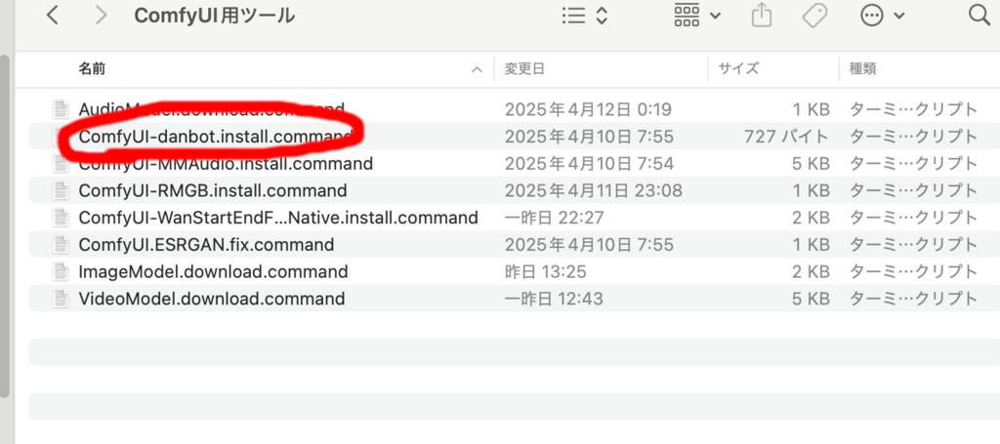
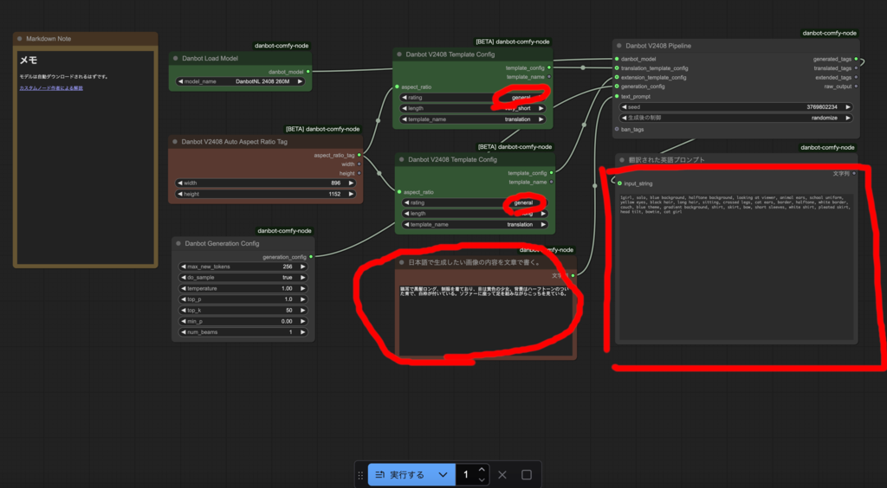
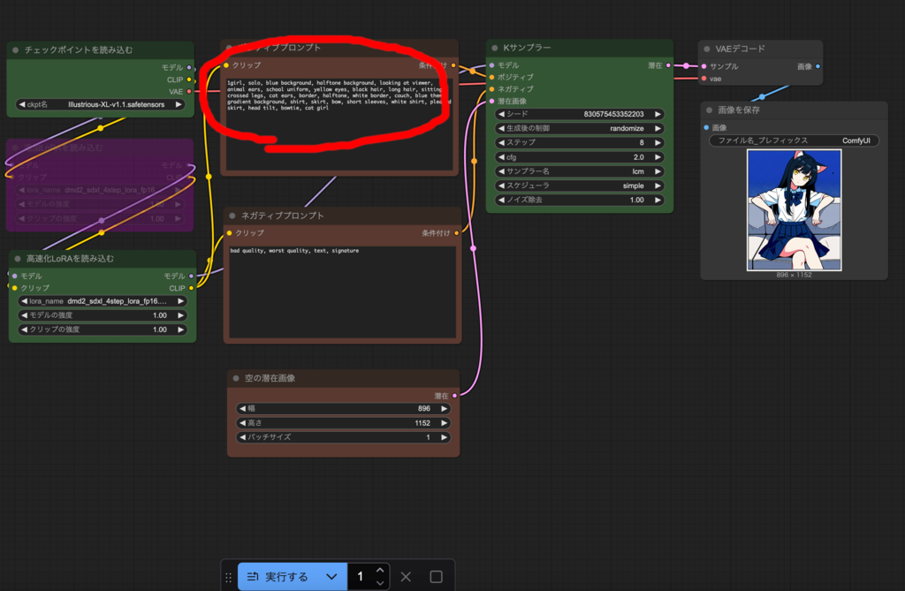
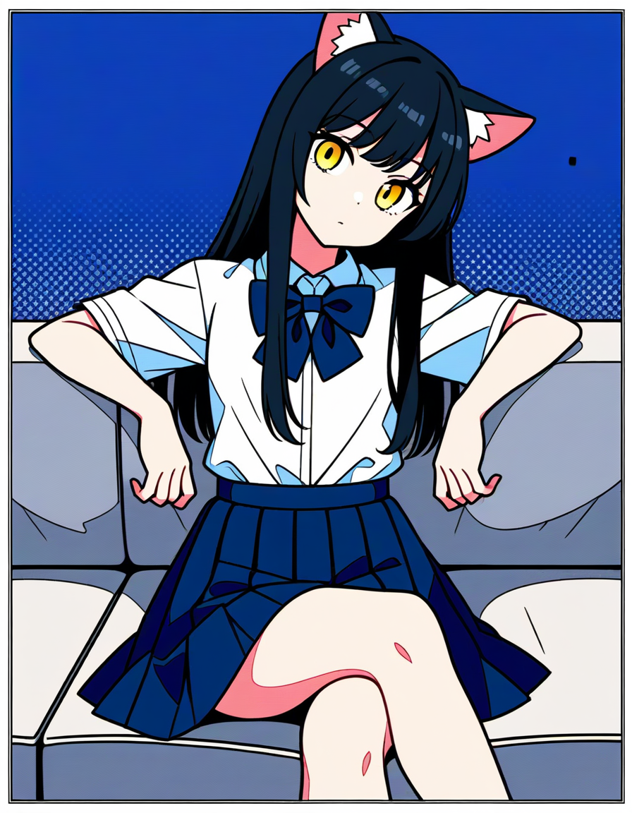
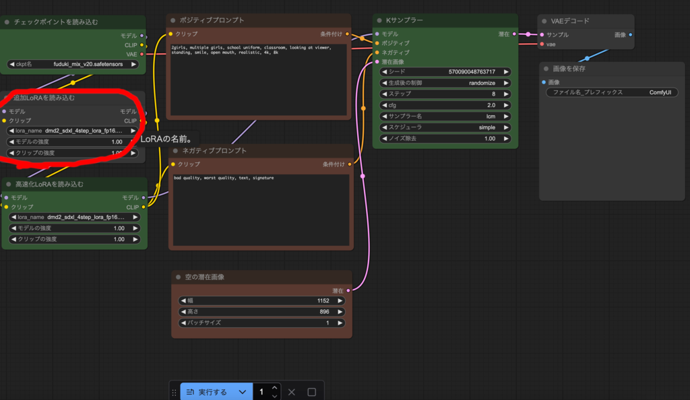

### 日本語文章による画像生成
生成する画像に対する指示は英語のプロンプトで行います。
英語が不慣れな方には難しいので、日本語の文章を英語プロンプトに変換する
ワークフローを用意しました。

ただ、2025/4/11時点では、非常に新しいカスタムノードのせいか、カスタムノードの評価がされていない関係で、
ComfyUI-Manager ではそのままではセキュリティ上インストールできません。

ComfyUI フォルダの user フォルダの default フォルダの ComfyUI-Manager 
フォルダにある『config.ini』の security_level を weak にして
インストールすることもできますが、インストール用スクリプトを用意したので、
そちらからインストールしてください。

一旦 ComfyUI Destkop を終了してください。



『ComfyUI-danbot.install.command』をダブルクリックで起動し、
ComfyUI のインストールフォルダを選択すればインストールされます。

もう一度 ComfyUI Desktop を起動してください。

『1.5.1.日本語文章英語プロンプト化.json』を開いてください
(ノードが見当たらない場合は右下のメニューの□を押してください）。



『中央下の日本語で生成したい画像の内容を文章で書く』ノードに
生成したい画像について日本語の文章で描いてください。

```
猫耳で黒髪ロング、制服を着ており、目は黄色の少女。背景はハーフトーンの
ついた青で、白枠が付いている。ソファーに座って足を組みながらこっちを見ている。
```

実行するを押すと、モデルが自動的にダウンロードされ、
右の翻訳された英語プロンプトに対応する英語プロンプトが
表示されます。

```
1girl, solo, blue background, halftone background, looking at viewer, 
animal ears, school uniform, yellow eyes, black hair, long hair, 
sitting, crossed legs, cat ears, border, halftone, white border, 
couch, blue theme, gradient background, shirt, skirt, bow, 
short sleeves, white shirt, pleated skirt, head tilt, bowtie, cat girl
```

これをコピーして『1.1.1.画像生成基本T2I.json』ワークフローを開き、



ポジティブプロンプトに貼り付けて画像生成してください。



カスタムノードの作者より
[技術的な詳細を含む解説](https://zenn.dev/platina/articles/66ac45608c836e)が
あるので参考にしてください。

なお、中央上段のノードと中段のノードで rating が general(一般的)に
なっています。この設定の場合、『一般的でない画像を表現した日本語文章』でも、
そのような部分を削除して一般的な画像向けの英語プロンプトが生成されます。
一般的でない画像を生成したい場合はここを変更してください
(カスタムノードの作者が触れていないのでわざとぼかしています)。

### 追加LoRA使用方法
LoRA は既存のモデルに対して追加学習することで、画風を変えたり、
キャラクタを再現できるようにする追加モデルです。

『1.1.1.画像生成基本T2I.json』をはじめ今までのワークフローには
紫色で無効になっているノードが存在していたと思います。


ノードをクリックした時にノードの上部にでるメニューに左から２番目の
ボタンを押すとノードが有効になります。



もう一度押すと無効に戻ります。

『追加LoRAを読み込む』ノードを有効にして、[civitai](https://civitai.com/)等から
ダウンロードした LoRA モデルファイルを、models フォルダの
 loras フォルダに移動させ、
メニューの編集のノード定義を更新を押し、
LoRA モデルを指定すれば、その LoRA を使用できます。

必要に応じて LoRA を活用してください。
