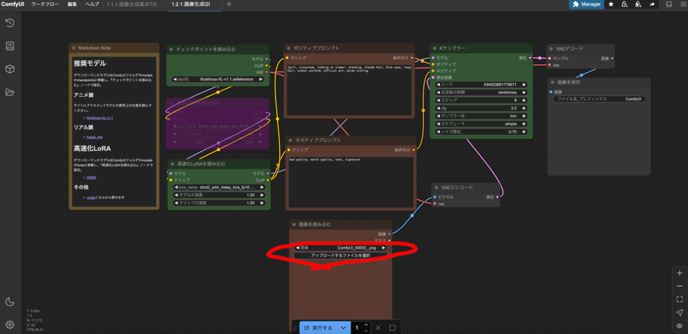
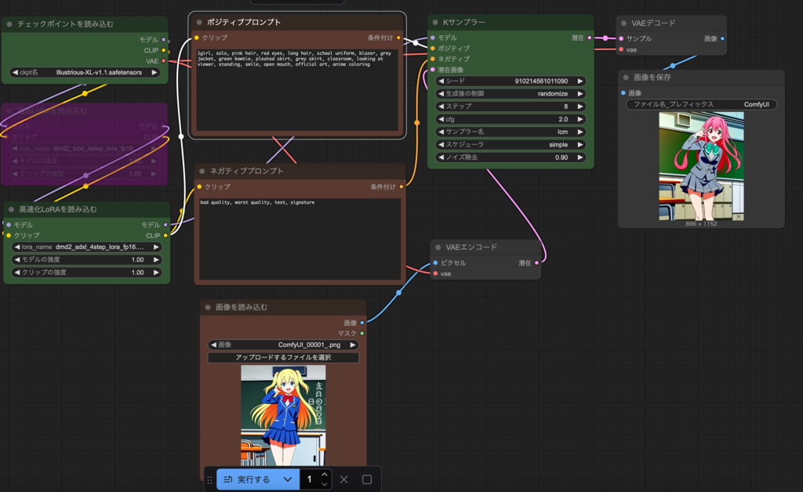
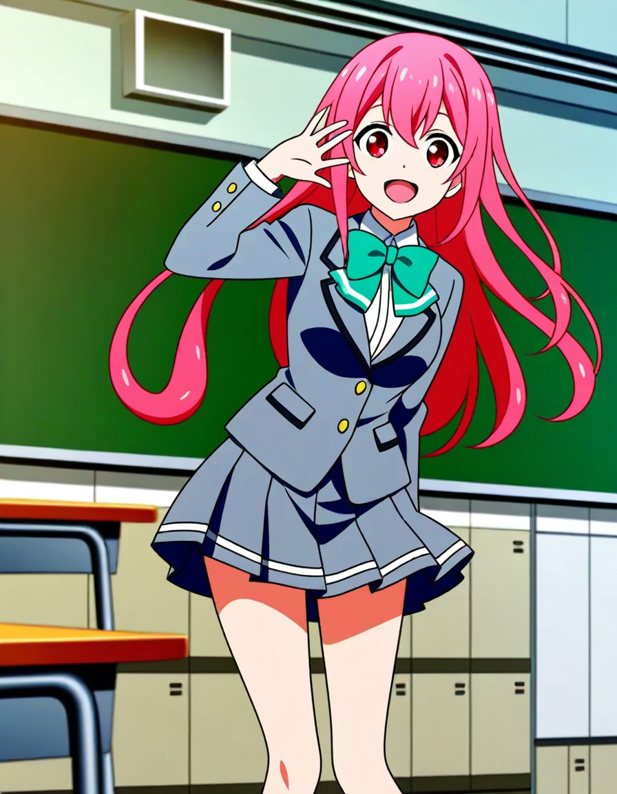
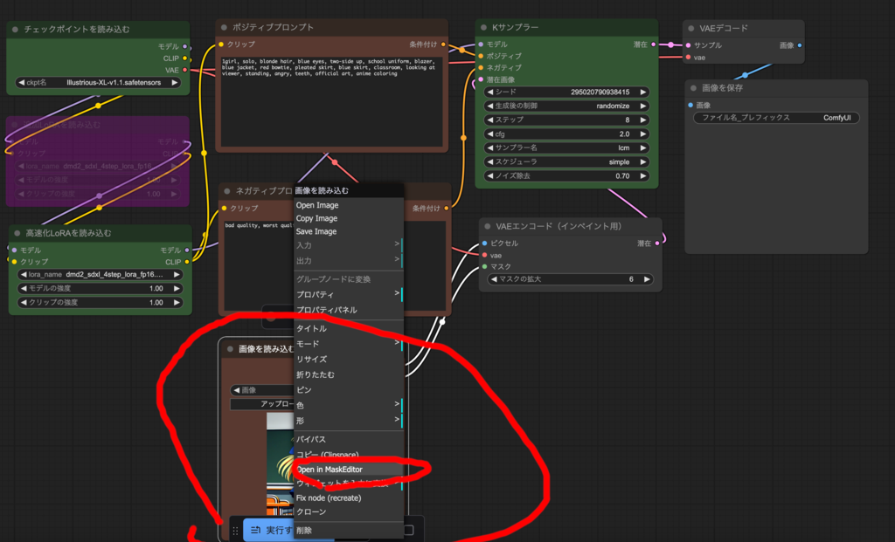
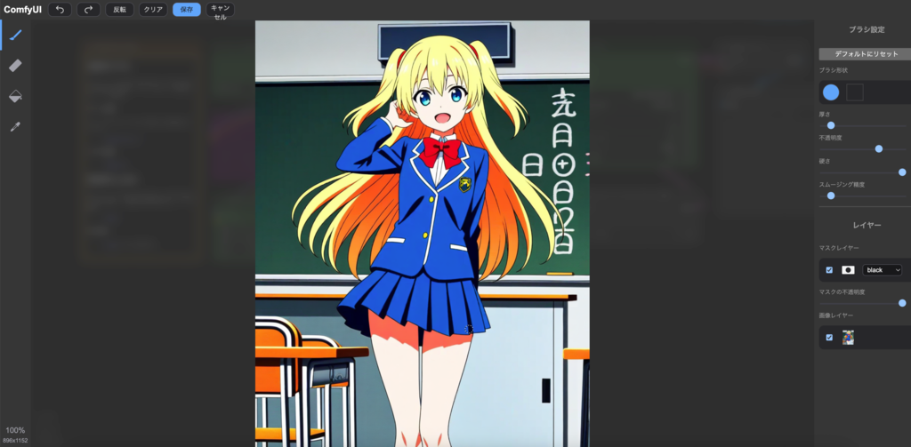
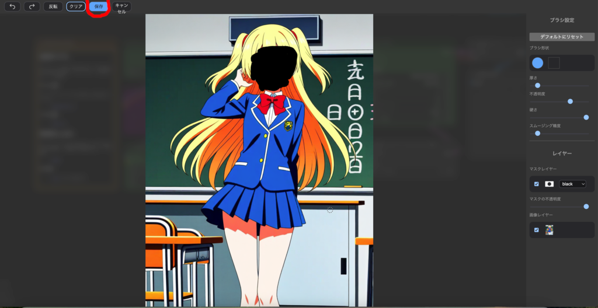
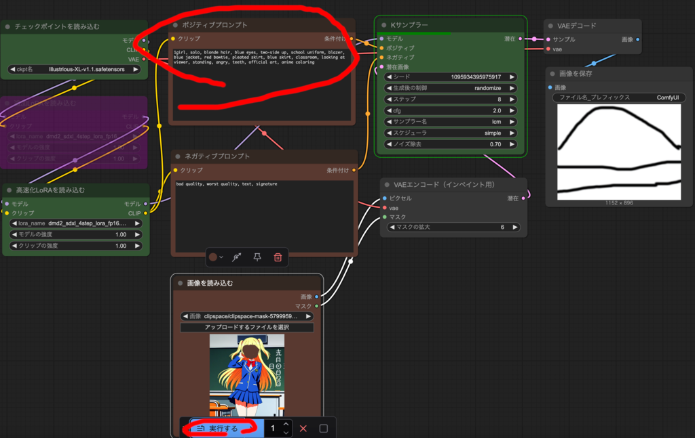
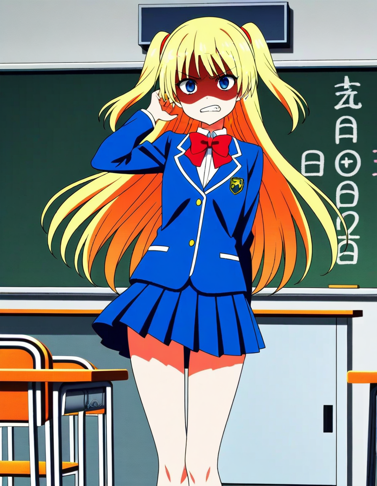

### 画像と文章に基づく画像生成

文章に基づき画像を生成するのではなく、元となる画像(Image)から
別な画像(Image)を生成することを、Image to Image(I2I)といいます。

ワークフローから開くを選び、ComfyUI フォルダの workflows フォルダの
『1.2.1.画像生成I2I.json』を開いてください。



中央下の画像を読み込むのアップロードするファイルを選択して先ほど
生成した最初に生成したアニメ調少女の画像を選択してください。
アップロードといってもネットのどこかにアップロードするのではなく 
ComfyUI フォルダの input フォルダにコピーしているだけです。

もしくは直接 Finder で output フォルダから input フォルダにファイルを
移動させて、メニューの編集からノード定義を更新を選んでも OK です。

その画像を選択してください。



ポジティブプロンプトに次の文を入れて実行するを押してください。

```
1girl, solo, pink hair, red eyes, long hair, school uniform, blazer, 
grey jacket, green bowtie, pleated skirt, grey skirt, classroom, 
looking at viewer, standing, smile, open mouth, official art, anime coloring
```

元の画像の雰囲気を保ちつつ、ピンク髪ポニーテイルで赤目でグレーの
ジャケットとスカートの少女の画像が生成されるはずです。



右の K サンプラーノードのノイズ除去の値を増やすと元の画像から離れる代わりに
プロンプトの指示により近づきます。ノイズ除去の値を減らすと、元の画像に近づきます。

今回は強くしないと変化が少なかったので 0.9 にしていますが、通常は大きくても
0.70 以下にするのが普通です。

#### 付録
『1.2.2.画像生成I2I（出力から）.jsonのワークフローはoutputフォルダから
直接画像を読み込めるようにしたものです。以降のワークフローにも
同様に output フォルダから読み込めるワークフローを用意している場合が
あるので、input フォルダにアップロードするのが面倒な場合は
こちらを使用してください。

### インペイント
生成画像の一部だけ不満があり、一部だけ修正したい場合があります。

元画像に対して修正したい部分を塗って示し、その部分だけ
I2I による画像生成を行うインペイント機能を使うことで実現できます。

『1.2.3.画像生成インペイント.json』ワークフローを開いて、
中央下の『画像を読み込む』ノードで先ほどと同じ画像を選択してください。



『画像を読み込む』ノードで右クリックをして、Open Mask Editor を選びます。



変更したい箇所をマウスでなぞって指定します。


とりあえず顔の辺りを塗ってください。
上のメニューから保存を選びます。



ポジティブプロンプトに次の文を入れて実行するを押してください。

```
1girl, solo, blonde hair, blue eyes, two-side up, school uniform, blazer, 
blue jacket, red bowtie, pleated skirt, blue skirt, classroom, 
looking at viewer, standing, angry, teeth, official art, anime coloring
```

歯を出して怒っている(angry, teeth)画像が生成されるはずです。



インペイントを上手に使うと、望む画像を生成しやすくなると思います。
