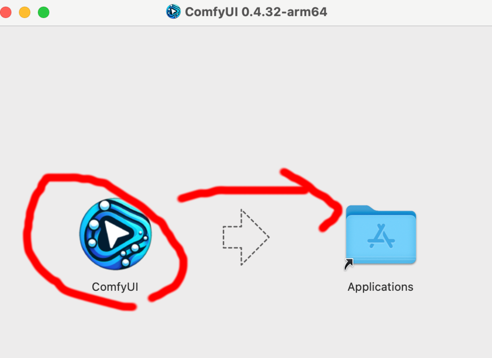
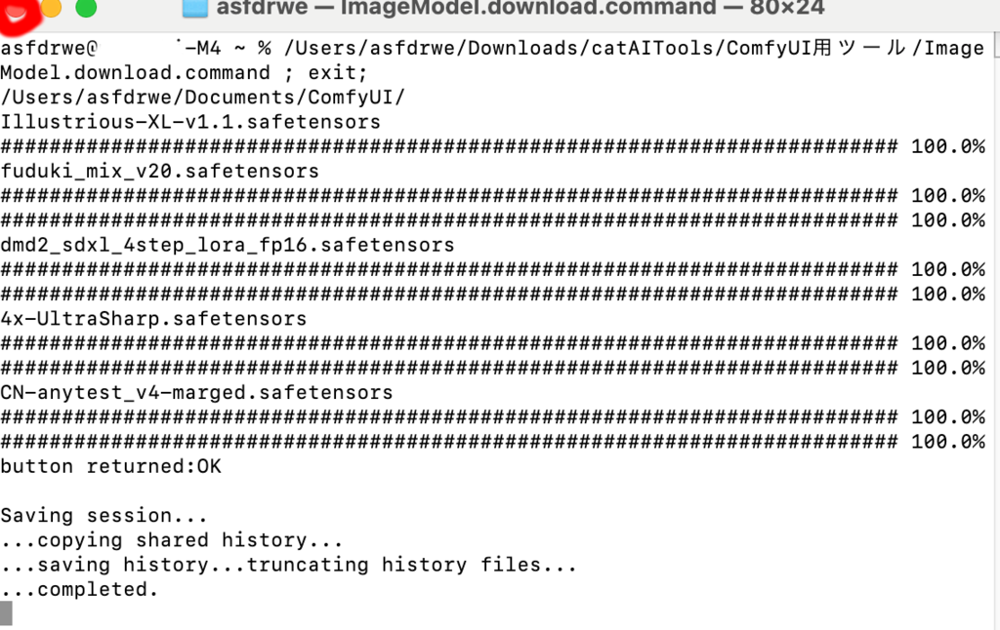

### ComfyUI のインストール
ComfyUI Desktop を使用して画像生成を行います。

[ComfyUI Desktop](https://www.comfy.org/download) からダウンロードしてください。

Finder でダウンロードを開いてください。

『ComfyUI 0.4.32 - arm64.dmg』(バージョンは異なる場合があります)をダブルクリックしてください。

ComfyUI のアイコンを Applications にドラッグしてインストールしてください。

デスクトップの『ComfyUI 0.4.32 - arm64.dmg』 を右クリックして
"ComfyUI 0.4.32-arm64" を取り出すを押してディスクを取り外し、
ダウンロードフォルダの『ComfyUI 0.4.32 - arm64.dmg』は
ゴミ箱にいれて削除してください。

次に LaunchPad から ComfyUI を起動してください。

初回は警告が出ますが、開くを押してください。

画面の指示に従い ComfyUI のインストールを行います。

標準では書類フォルダ(/User/ユーザ名/Documents)内に作成される
ComfyUI フォルダ以下にプログラムや使用するモデルや生成された画像が置かれます。

推奨モデルを利用する場合モデルだけで数十 GB 消費するので、ストレージが
足らない場合は外付け SSD 等を指定してそちらに置くようにしてください。
あとからフォルダを移動させると正常に動作しないので、最初に外付け SSD 等を
指定してください。あとから移動させたい場合は、ComfyUI Desktop を
再インストールしてもう一度設定してください。

画面の指示に従いインストールを完了させてください。

起動したら一旦なにもせず閉じてください。

### 推奨モデルのダウンロードと用語解説

#### ワークフロー
ComfyUI で実行する処理手順を記載したものがワークフローです。処理単位にあたるノードを
つないで作成します。

ワークフローは本来自身で作成して実行するものです。ただ、生成 AI の仕組みが
わからないと一から自力で作成するのは難しいので、M4 Mac Mini でも実用可能な速度で
動くよう調整済みで、さまざまな用途に対応するワークフローを用意しました。

catAITools フォルダの workflows フォルダに入れてあります。この文書で
使い方を順次解説していきます。

なお、こちらの用意したワークフローでは、どこを変更する必要があるかわかりやすくするために、
処理内容に合わせて設定・記述すべきノードを茶色、必要に応じて変更するノードを緑色、
通常変更する必要がないノードを灰色、説明用のノードを黄土色にしてあります。
無効なノードは紫色にしています。これは一般的なルールではなくこちらのワークフローのみの
ローカルルールです。

#### モデル
ComfyUI では画像や音声、動画などを生成するためにさまざまなモデルを使用します。

ワークフローのノードで使用するモデルは自動的にダウンロードされるものものありますが、
別途ダウンロードしないといけないものが大半です。

推奨モデルをダウンロードするユーティリティを用意しました。

catAITools フォルダのComfyUI用ツールフォルダを開いてください。

中にある『ImageModel.download.command』をダブルクリックしてください。

指示に従い、ComfyUI のインストールフォルダを選んでください
(標準では書類フォルダの ComfyUI フォルダ)。

推奨モデルをダウンロードしますか？と聞かれるのではいを押してください。
推奨モデルをダウンロードを開始します。

ダウンロードが終了するとダイアログが出るので OK を押してください。

さらにスクリプトを実行していたターミナルを閉じてください。

ダウンロードするモデルは全部で5つあり数十 GB あります。通信データ量が大きいので
時間がかかります。モバイル回線で落とす場合は気をつけてください。

#### カスタムノード
ComfyUI はノードをつないでワークフローを作ります。標準で提供されているノードの他に
さまざまなカスタムノードが存在します。

ComfyUI Desktop でインストール時に自動でインストールされる ComfyUI Maneger も
カスタムノードの1つで、さまざまなカスタムノードを管理できます。
ワークフローに含まれているがインストールされていないカスタムノードを
自動的に調べてインストールできる機能があるので、基本的には
ワークフローを開いたときの指示に従い ComfyUI Manager で
必要なカスタムノードをインストールします。

カスタムノードはさまざまな作者が独立して作成しています。

あるカスタムノードをインストールすると依存するライブラリが競合
するため別なカスタムノードが動かなくなったり、同じ機能を持つカスタムノードが
何種類もあったり、
過去、[情報を盗むなど悪意のあるカスタムノード](https://note.com/st_ai/n/ne0cdaca09525)が発見されたりしています。

むやみやたらと カスタムノードをインストールするのは好ましくないです。

カスタムノード管理する ComfyUI Manager は十分検証されていないカスタムノードを
標準ではインストールできないようになっています。

この文書の一部のワークフローに ComfyUI Manager をセキュリティレベルを
下げないとインストールできないカスタムノードを含むものがあります。

ComfyUI Manager でインストールする場合は ComfyUI フォルダの user フォルダの
default フォルダの ComfyUI Manager フォルダの『config.ini』を開き、
security_level を normal から weak に書き換え、セキュリティレベルを
下げる必要があります。 

また使用するカスタムノードにはそのままでは Apple Silicon Mac で
動かないものもあり、コードの修正が必要です。

手動でこれらの作業を行うのは面倒なので、そのようなカスタムノードの
ためのインストール＆修正スクリプトを用意しました。

推奨モデルのダウンロードツールと同様に catAITools の ComfyUI用ツール 
フォルダに入れてあります。

この文書のワークフローでは必要なカスタムノードをこのツールで
インストールしてください。

なお、こちらが作成したワークフローはなるべくカスタムノードを使わず
標準のノードメインで実行できるよう構成しています。
