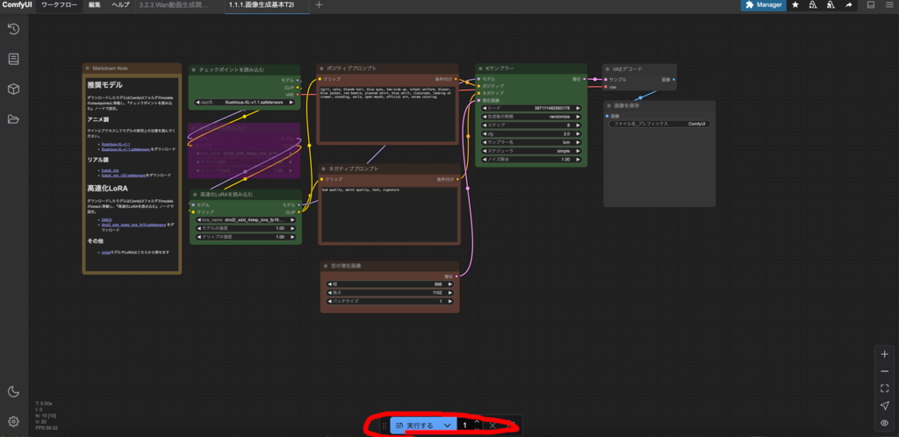
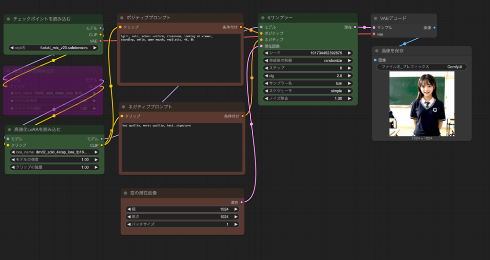

### 文章に基づく画像生成

LaunchPad から ComfyUI Desktop を起動してください。


### はじめての画像生成


メニュー左上のワークフローから開くを押してください。


ComfyUI フォルダの workflows フォルダの『1.1.1.画像生成基本T2I.json』を開いてください。



推奨モデルをダウンロードしている場合はそのまま実行できます。
下の実行するを押してください。

金髪ツインテール青目で青ブレザー赤タイ青いスカートの制服を
着た女の子が教室で口を開けてこちらを向いて微笑んでいるアニメ風の
896x1152 サイズの画像が 1 分程度で生成されるはずです。


### 生成画像への指示


中央のポジティブプロンプトがどんな画像を生成するかの指示になります。
文章(Text)から画像(Image)を生成するので、Text to Image(T2I)といいます。

今使用しているモデル(Illustrious-xl-v1.1)では英語で単語に区切って与えるのが通常です。

```
1girl, solo, blonde hair, blue eyes, two-side up, school uniform, 
blazer, blue jacket, red bowtie, pleated skirt, blue skirt, 
classroom, looking at viewer, standing, smile, open mouth, 
official art, anime coloring
```

- 1girl => 少女1人
- solo => 他に人がいない
- blonde hair => 金髪
- blue eyes => 青い目
- ...

このように英単語で生成したい内容を記述します。


ポジティブプロンプトを次のように変えて実行を押してください。

```
1girl, solo, black hair, brown eyes, long hair, school uniform, 
serafuku,  green neckerchief, pleated skirt, blue skirt, classroom, 
looking at viewer, standing, smile, open mouth, official art, anime coloring
```

黒髪ロング茶色目で緑タイ青スカートのセーラー服の女の子が教室でこちらを
向いて微笑んでいるアニメ風の896x1152サイズの画像が生成されるはずです。


このように英語で生成したい画像に関する内容を記述することで画像を生成できます。
このような英単語の羅列による生成画像への指示をプロンプト(prompt)をいいます。

英語が苦手な方のために、
[日本語文章を英語プロンプトに翻訳するワークフロー](image-extra.md)を
用意してあり、のちほど説明します。

この文書では基本的に英語プロンプトを使用します。

### ComfyUI の基本操作
生成された画像等は ComfyUI フォルダの output フォルダに入ります。
Finder で開いて確認してください。


実行するの右の数字で繰り返す回数を指定できます。
未実行のものはキューに入ります。さらに隣の❌を押すと現在の処理を中止できます（すぐに止まらない場合もあります)。さらに右の🔲を押すとキューに入っている処理をクリアできます。

ノードのないところをドラッグするとワークフロー全体を移動できます。
ホイールの回転か右下の＋ーでワークフローの拡大縮小ができます。


右下のメニュー中央の🔲を押すとノードのある位置が中央になります。

### ノードの解説
各ノードに生成したい画像に関する設定を行うことで自由に画像を生成できます。

- ポジティブプロンプト

生成したい画像を記述するメインの内容を記述します。

- ネガティブプロンプト

生成したい画像に入って欲しくない内容を記述します。

- 空の潜在画像

生成する画像の大きさを指定します。


空の潜在画像で幅を1152、高さを896にし、ポジティブプロンプトに次の文を入れて実行するを押してください。

```
2girls, multiple girls, school uniform, classroom, looking at viewer, 
standing, smile, open mouth, official art, anime coloring
```

1152x896サイズの2人の少女の画像が生成されます。


- K サンプラー

画像の生成に関する設定です。ステップを上げればより高画質になりますが、
その分時間がかかります。生成を高速化する技術高速化 LoRA により少ないステップ数で
での生成を可能にしています。
仕様上は4ステップで生成可能となっていますが、品質がいまいちなので 8 ステップに
設定しています。必要に応じてステップ数を変更してください。

- チェックポイントを読み込む

使用するモデルを指定します。

- 高速化LoRAを読み込む

高速化 LoRA を読み込みます。通常は変更する必要はありません。

- 追加LoRAを読み込む

LoRA を追加する場合に有効にします。詳しくは
[その他の追加LoRA使用方法](image-extra.md)で説明します。

### モデルの変更


『チェックポイントを読み込む』ノードで ckpk 名を
fuduki_mix_v20.safetensorsに変更し、
『空の潜在画像』ノードで幅を1024、高さを1024にし、
ポジティブプロンプトを次のようにして実行するを押してください。

```
1girl, solo, school uniform, classroom, looking at viewer, 
standing, smile, open mouth, realistic, 4k, 8k
```




リアル調の制服少女の画像が生成されます。


『空の潜在画像』ノードで幅を 896、高さを 1152 にし、
ポジティブプロンプトを次のようにして実行するを押してください。

```
cat, walking, bedroom, looking at viewer, sheet, pillow, window, 
no person, realistic
```
リアル調の猫が寝室で歩いている画像が生成されるはずです。


モデルによって画風は大きく変わります。

### ワークフロー


メニューのワークフローの保存を押すとワークフローを保存できます。
ComfyUI フォルダの user フォルダの default フォルダの workflows フォルダに
保存されます。保存したワークフローは左側のメニューから直接開けます。

エクスポートするとファイルとしてワークフローを保存できます。
ワークフローの開くから開けますし、ネットにアップロードして
公開することもできます。


ComfyUI が提供するワークフローがあり、メニューのワークフローの
テンプレートを参照から選べます。カスタムノードによっては
ワークフローを提供しているので、ComfyUI フォルダの custom_nodes フォルダの
各カスタムノードフォルダを開くと見つかる場合もあります。

[civitai](https://civitai.com/)でもさまざまなワークフローが公開
されているので、必要に応じて参照してください。

### 生成のコツ
画像生成 AI では常にうまく生成されるとは限らないです。

何度も生成して良いと思った画像を採用する形になるのでよく『ガチャ』と
言われます。

また、モデルによって得意分野が異なり、同じプロンプトでも生成画像が
全く異なります。

推奨モデルの Illustrious-XL はアニメ・イラストが得意なモデルで、
fuduki_mix は写真のようなリアル調が得意なモデルです。

モデルは[huggingface](https://huggingface.co)や[civitai](https://civitai.com/)などにたくさんあるので、探してみてください。

画像生成 AI では、プロンプトを変えたり、モデルを変えたり、何度も生成するなど
試行錯誤が必要なことを頭に入れてください。
