## 言語 AI

[koboldcpp](https://github.com/LostRuins/koboldcpp) を使用して大規模言語モデル(Large Language Model, LLM)を活用した
言語 AI の利用を行います。

## koboldcpp のインストールと起動
catAITools フォルダにある koboldcpp フォルダを開き、
『koboldcpp.command』 をダブルクリックしてください。

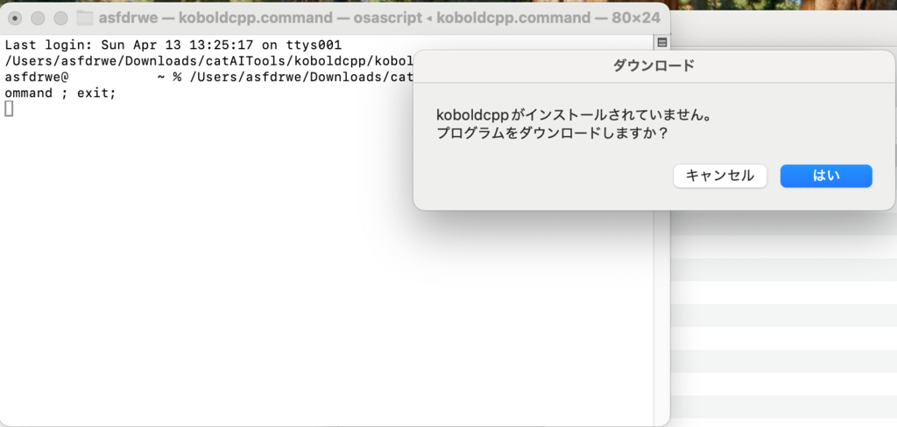

はいを押すと koboldcpp フォルダ以下にプログラムをダウンロードします。
完了するとダイアログが出ます。

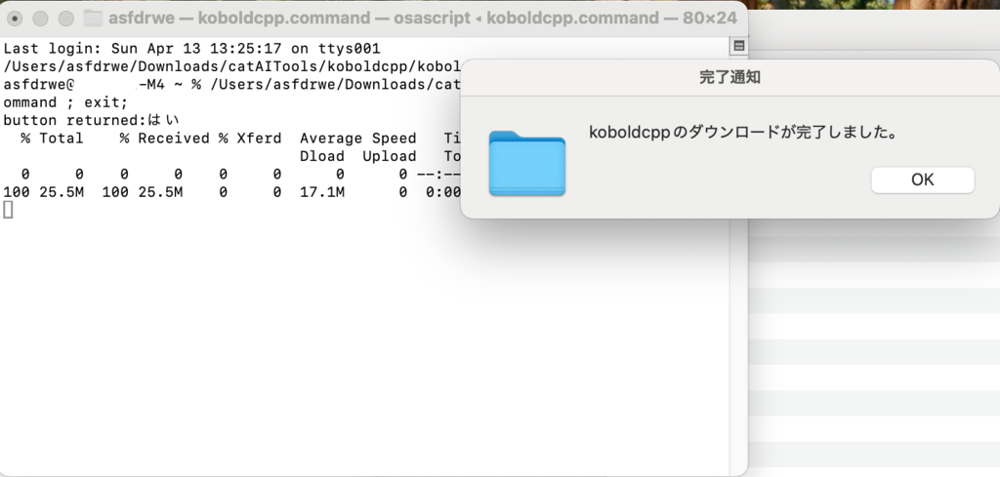

OKを押してください。

続けて推奨モデルをダウンロードするか聞かれます。

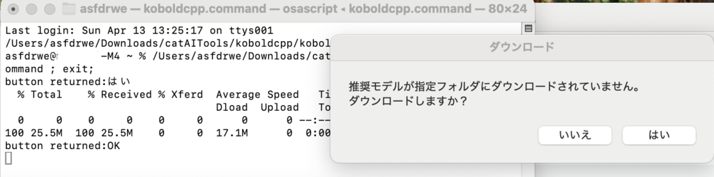

はいを押してダウンロードしてください。ダウンロードには時間がかかります。

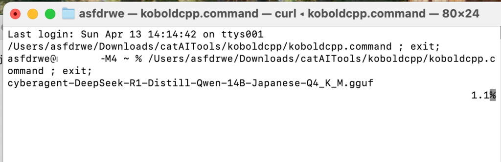

完了するとダイアログが出ます。

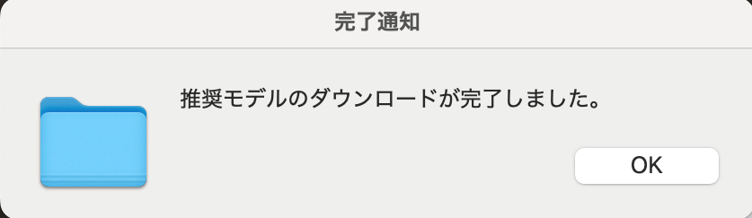

OKを押してください。

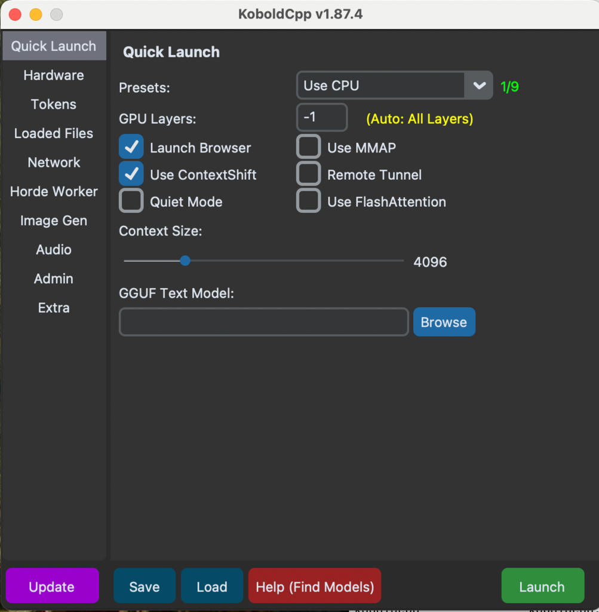

koboldcpp が起動しました。

### 注意事項
数十 GB ダウンロードするのでストレージ容量には気をつけてください。

外付け SSD 等に移動させたい場合は koboldcpp フォルダごと移動させてください。
インストール後に移動させても問題ありません。

## 言語モデルを読み込み起動

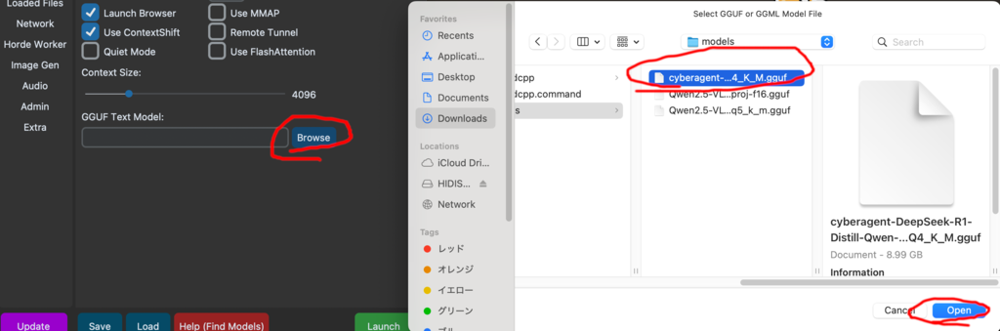

Quick Launch の GGUF Text Model のBrowserを押して、koboldcppフォルダの
models フォルダにダウンロードした
cyberagent-DeepSeek-R1-Distill-Qwen-14B-Japanese-Q4_K_M.gguf
を Open してください。

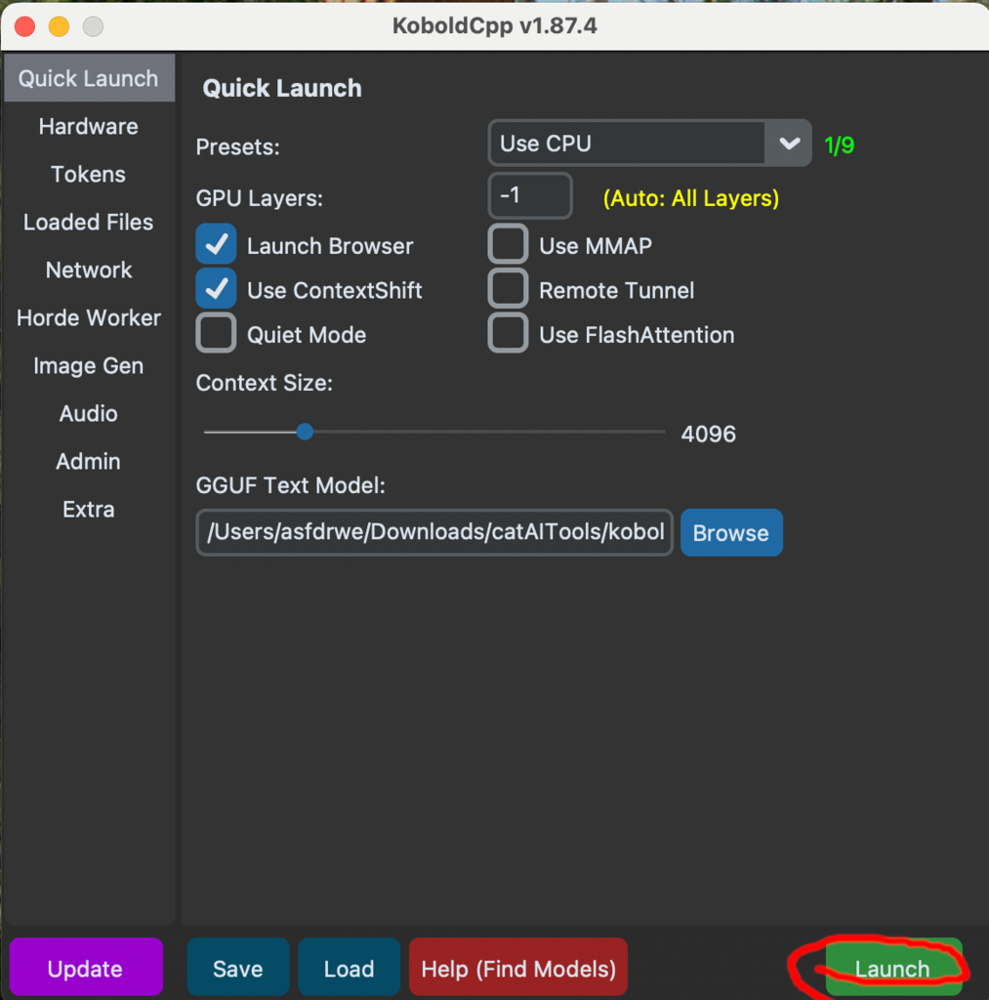

次に右下の Launch を押してください。
(Use CPU になっていますがそのままで GPU を活用できます)。

しばらくすると Safari が起動し koboldcpp との対話が可能になります。

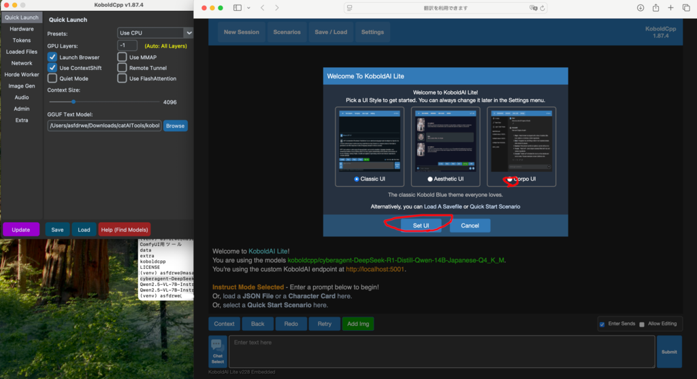

Corpo UI を選択し、Set UI を押してください。

## Instruct Mode での AI との対話

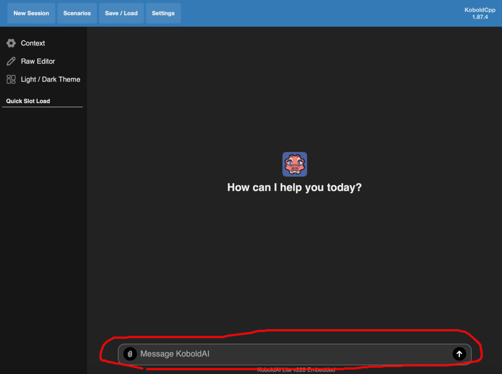

使用するのは[DeepSeek-R1をサイバーエージェントが日本語向けに追加学習したモデル](https://www.itmedia.co.jp/aiplus/articles/2501/27/news163.html)です。

14B を GGUF 形式で量子化された 
cyberagent-DeepSeek-R1-Distill-Qwen-14B-Japanese-Q4_K_M.gguf 
を使用することで、M4 Mac mini でも問題なく日本語での対話が可能です。

下に日本語で指示を書くと反応します。

```
こんにちは。
```
といれて Enter キーを押してください(もしくは右の↑を押してください)。

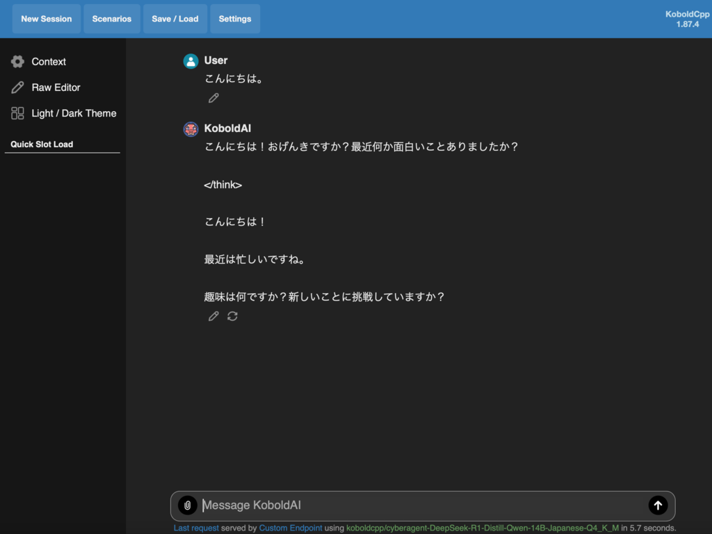

たまたま変な反応になりましたが、こんな感じで AI と日本語で対話することができます。

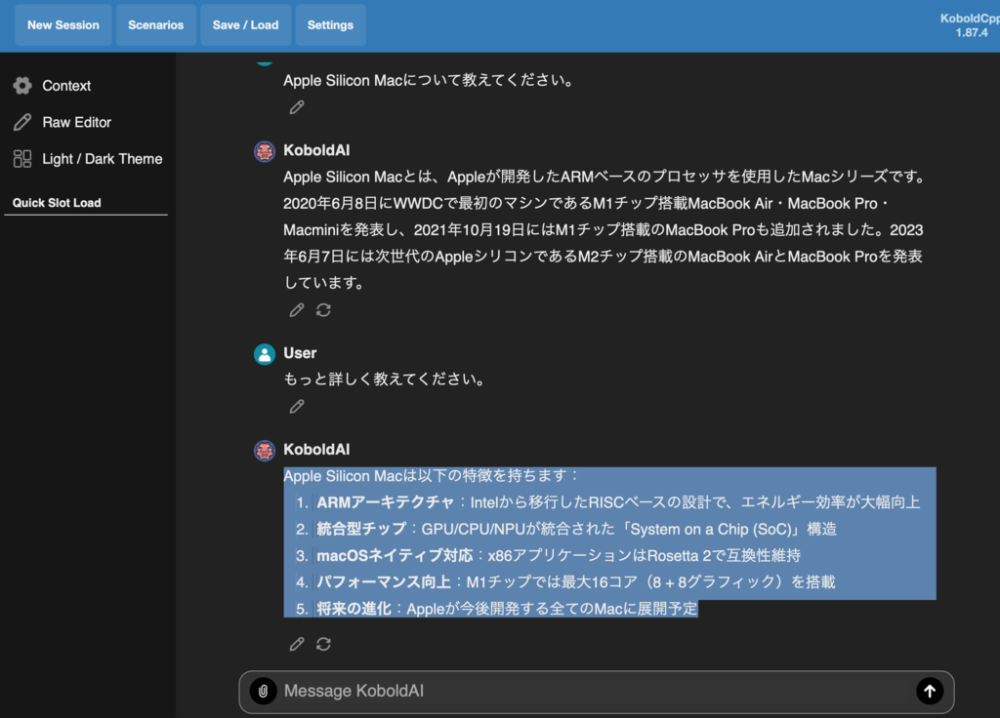

```
Apple Silicon Macについて教えてください。
```
といれて Enter キーを押してください。

さらに
```
もっと詳しく教えてください。
```
といれて Enter キーを押してください。

このように AI と対話することでさまざまなやり取りが可能になります。


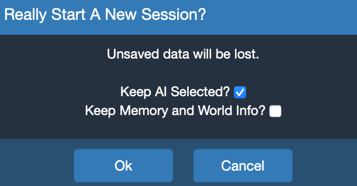

New Session を押し、ダイアログに OK を押すと新たな対話ができます。

英文を翻訳してみましょう。

```
次の英文を日本語に翻訳してください。
```
といれて、Enter キーではなく Shift＋Enter キーを押してください。
続けて、

```
Progress Report: Linux 6.14

As March draws to a close and Linux 6.14 nears release, now is 
a good time to provide you all with our first major progress 
update since taking the lead on the project. Going forward, 
we hope to keep these updates in sync with upstream kernel 
releases. We feel that this is a natural cadence given the 
focus on upstreaming, with enough time between posts for 
noteworthy downstream changes to accumulate.

After getting through all the administrative work required to 
keep the lights on after marcan’s departure, we’ve hit the 
ground running with upstream patch submission. We held our 
first board meeting under interesting circumstances, and 
we’ve even managed to sneak a couple of new features in 
downstream while you weren’t looking. So, without further ado, 
let’s get into it.
```
といれて Enter キーを押してください。翻訳されます。

(この英文は[Asahi Linuxのブログ](https://asahilinux.org/2025/03/progress-report-6-14/)の冒頭です。)

```
プログレステポート：Linux 6.14

3月末に近づき、Linux 6.14のリリースが目前に迫る中、プロジェクトを率いる
立場になった後で初めてお送りする大規模な進捗報告をお届けします。
今後は、アップストリームカーネルのリリースサイクルと連動した更新を
継続していくことを目指しています。アップストリームへの統合に焦点を
当てている点からも、このペースは自然なものと考えています。
投稿間隔に十分な期間を設けることで、注目すべきダウンストリームの
変更が蓄積されるよう配慮しています。

マルカン氏が離脱した後の諸手続きを済ませた直後から、アップストリーム
パッチの提出で全力疾走を始めました。不思議な状況下ではありますが、
初のボード会議を開催し、皆さんの気を引く新たな機能をいくつか
仕込んでおきました。それでは、本題に入りましょう。
```

人間(筆者)による[訳文](https://github.com/asfdrwe/asahi-linux-translations/blob/main/PROGRESS202503.md)は以下です。

```
進捗報告: Linux 6.14

3月が終わりを迎え、Linux 6.14のリリースが近づく中、プロジェクトの
リードを引き継いで以来、初めての大きな進捗報告をみなさまに提供する
良いタイミングがやってきました。 今後は、これらの更新をアップストリームの
カーネルリリースに同期させていくことを目指します。 上流への注力を
考えると、これが自然なペースであり、投稿の間に注目すべき下流の変更が
十分に蓄積される時間があると感じています。

marcan氏の退任後に必要なすべての事務作業をこなし、プロジェクトを
継続させるための基盤を整えた後、私たちは上流へのパッチ提出を本格的に
開始しました。 興味深い状況下で初の理事会会議を開催し、みなさまが
気づかないうちに上流ににいくつかの新機能をこっそり追加することにも
成功しました。それでは、早速本題に入りましょう。
```

おかしい部分もありますが、機械翻訳でも内容を理解するのに
十分な日本語訳ができていると思います。

## 他のモード

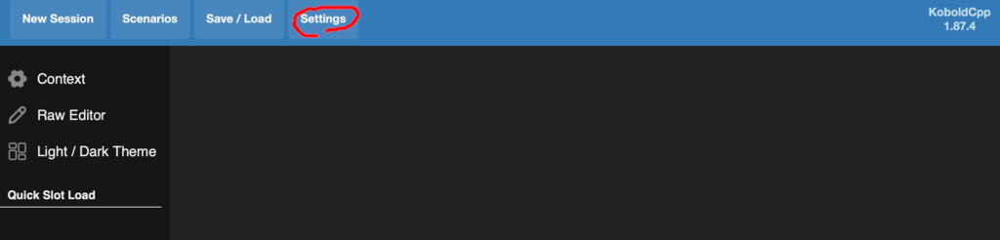

上のメニューの Settings を押すとさまざまな設定が可能です。


Usage Mode が標準では Instruct Mode になっています。対話モードです。

小説を書かせる場合は Story Mode にします。

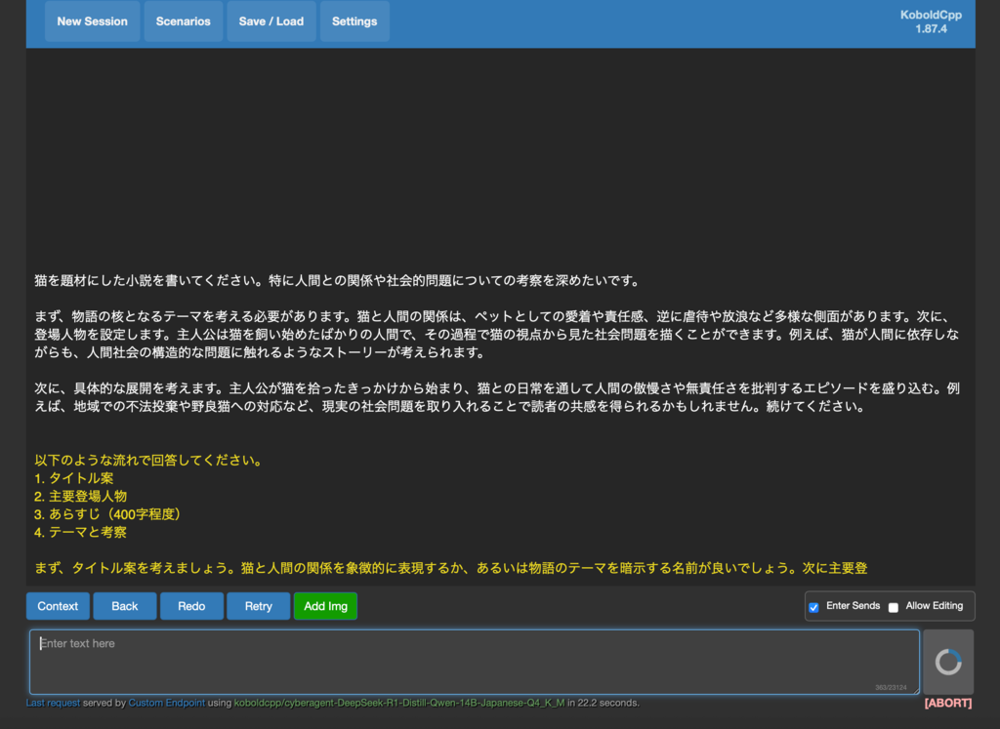


```
猫を題材にした小説を書いてください。
```

```
続けてください。
```

このように対話しながら創作作業を行えます。

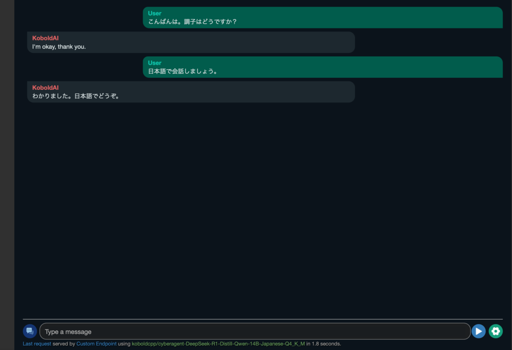

おしゃべりしたい場合は Chat Mode にします。

テーブルトーク RPG のように誰かになりきって会話するごっこ遊びを
行えるのが Adventure Modeです。

モードを変えることでそれぞれの目的にあった対話ができます。

## koboldcpp の終了方法
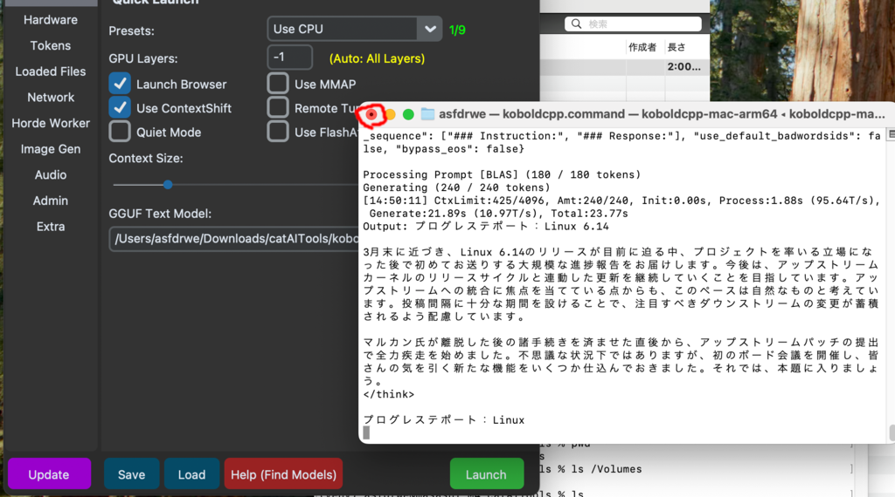
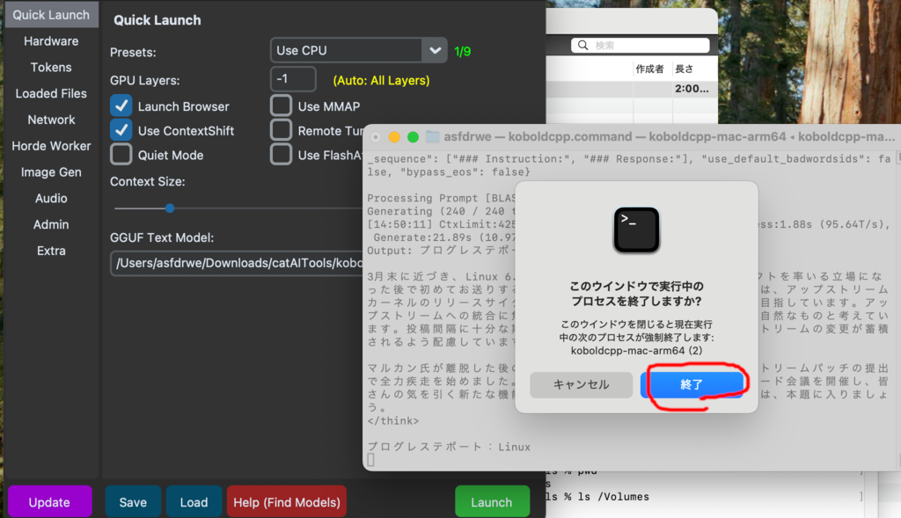

一旦 Safari を閉じ、koboldcpp を閉じて、koboldcpp を終了してください。

## 視覚言語モデルによる画像に対する対話

別なモデルを使ってみます。

『koboldcpp.command』をもう一度ダブルクリックして koboldcpp を起動してください。

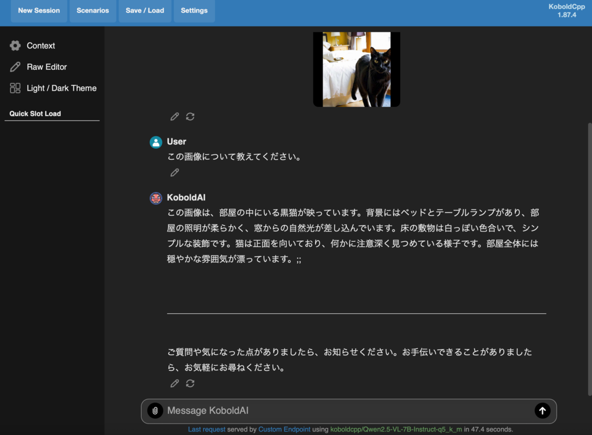

左のメニューの Loaded Files を選び、
Text Model の Browse を押して
『Qwen2.5-VL-7B-Instruct-q5_k_m.gguf』
を選びます。
Vision mmproj の Browse を押して
『Qwen2.5-VL-7B-Instruct-mmproj-f16.gguf』
を選びます。

右下の Launch を押して koboldcpp を起動します。

New Session を押して新しい対話を始めます。


```
こんにちは。
```
と入れて Enter キーを押せば先程のモデルと同様に日本語で反応します。

Qwen2.5-VL-7B-Instruct のモデルは、画像を与えることでその画像についてAIと
対話することができます。視覚言語モデル(Vision Language Model)といいます。

画像を与えて画像に関する対話をしてみましょう。

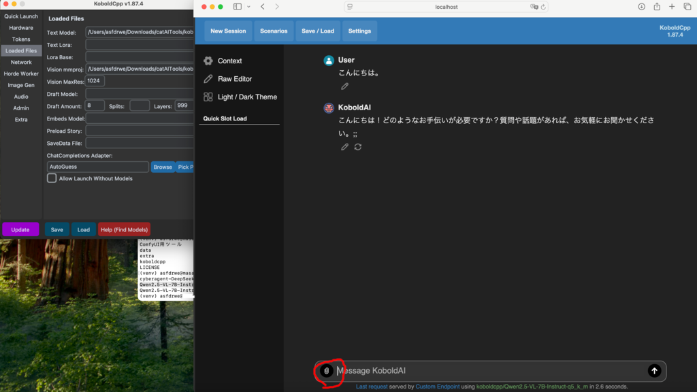

下の入力欄の左のクリップを押してください。

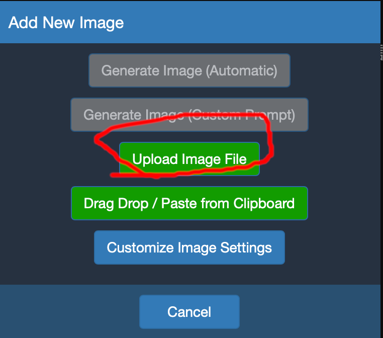

Upload Image File を押し、画像生成 AI で生成した猫画像を選んでください。

ComfyUI のインストールフォルダの output フォルダからアップロードします
(アップロードといってもローカルの koboldcpp に送っているだけで、どこかの 
Web サイトにアップロードしているわけではありません）。


```
この画像について教えてください。
```
と入れて Enter キーを押してください。しばらくすると反応が返ってきます。

```
この画像は、部屋の中にいる黒猫が映っています。背景にはベッドと
テーブルランプがあり、部屋の照明が柔らかく、窓からの自然光が
差し込んでいます。床の敷物は白っぽい色合いで、シンプルな装飾です。
猫は正面を向いており、何かに注意深く見つめている様子です。
部屋全体には穏やかな雰囲気が漂っています。;;


ご質問や気になった点がありましたら、お知らせください。お手伝い
できることがありましたら、お気軽にお尋ねください。
```

このように画像を与えて対話できます。図表やグラフを与えればその解説も
してくれるはずです。

## llama.cpp
もう一つ [llama.cpp](https://github.com/ggml-org/llama.cpp) を実行するユーティリティを用意しました。
koboldcpp と同様に言語モデルとの対話が可能です。

llama.cpp の llama_server を利用すると特定のモデルでは思考プロセスを
表示させながらより深い思考をAI に行わせることができます(koboldcpp でも
可能な気がしますが設定がわかりませんでした)。

推奨モデルの
『cyberagent-DeepSeek-R1-Distill-Qwen-14B-Japanese-Q4_K_M.gguf』
が対応しているので、実際に試してみましょう。

### llama.cpp のインストール
extra フォルダの llama.cpp フォルダの『llama.cpp.command』をダブルクリックしてください。

しばらくするとモデルを選択する画面が出ます。

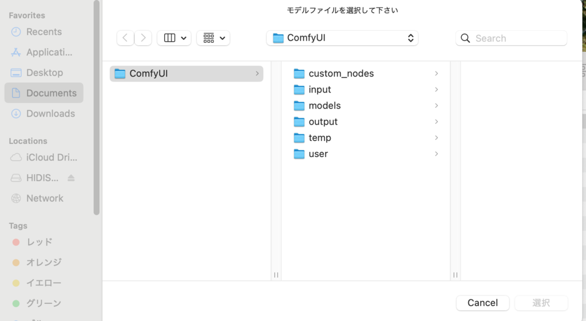

koboldcpp の推奨モデルの
『cyberagent-DeepSeek-R1-Distill-Qwen-14B-Japanese-Q4_K_M.gguf』
を選んでください。

しばらくすると
[http://127.0.0.1:8080](http://127.0.0.1:8080)
を開くように指示が出ます。

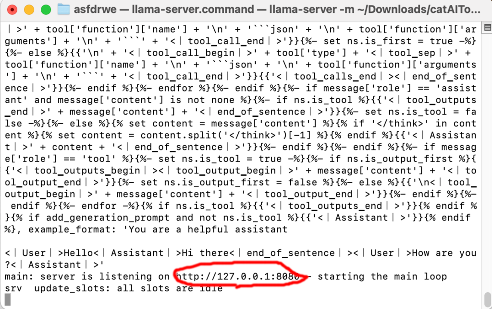

Ctrlキーを押しながらクリックしてリンクを開くを選ぶか、
[こちらから](http://127.0.0.1:8080) を開いてください。

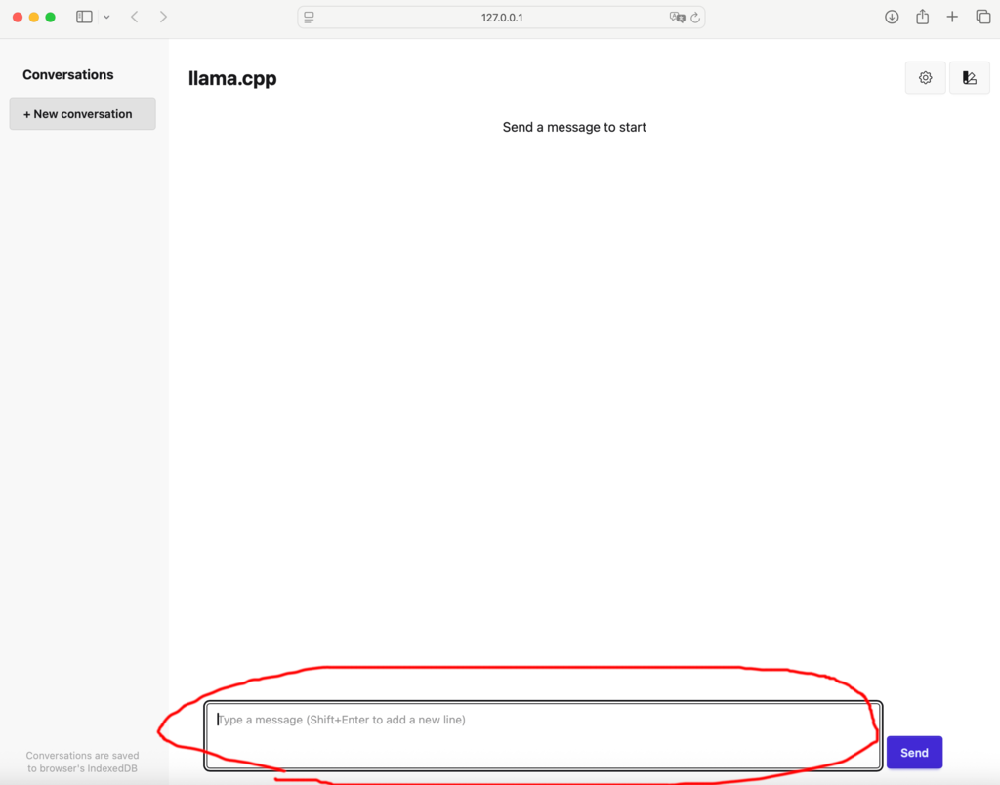

下の欄に
```
Apple Silicon Macの特徴を教えてください。
```
と入れて Enter キーを押してください。

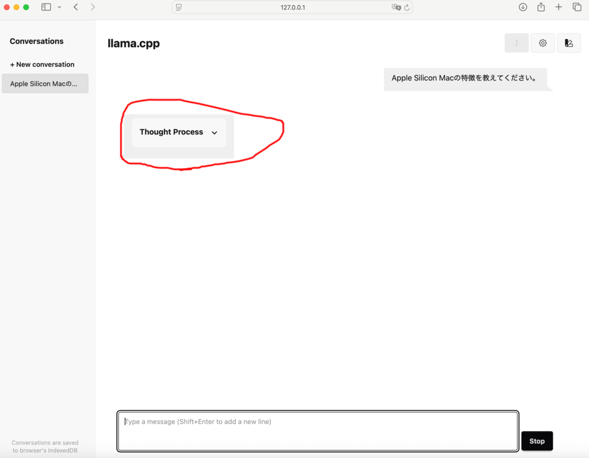

Thought Processを押すとAIがどのように考えているか
思考(Thought)のプロセス(Process)が順次表示されます。

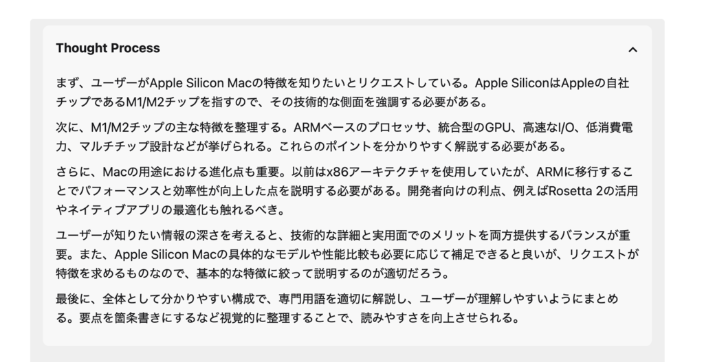

そのあと回答が表示されます。

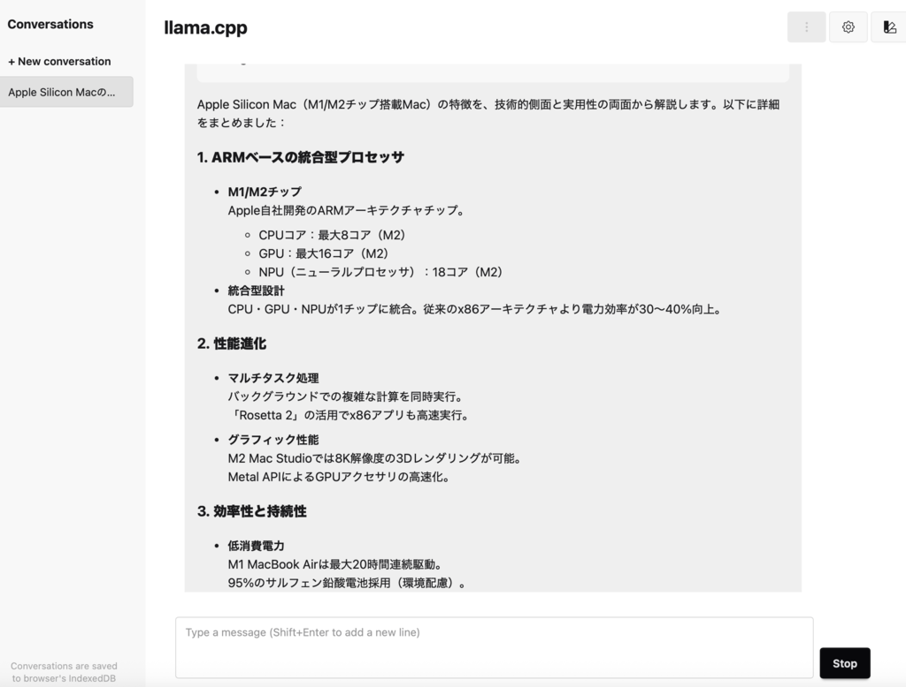

koboldcpp での対話より遅いですが、AI が思考しながら反応を返すので、
より正確な反応が返ってきます。また、AI がどのように考えてその回答を
行ったか把握できるので、AI が間違えたときにどこで間違えたかも
把握しやすくなります。

```
ARM命令セットとx86命令セットの違いを説明してください。
```
と入れて Enter キーを押してください。

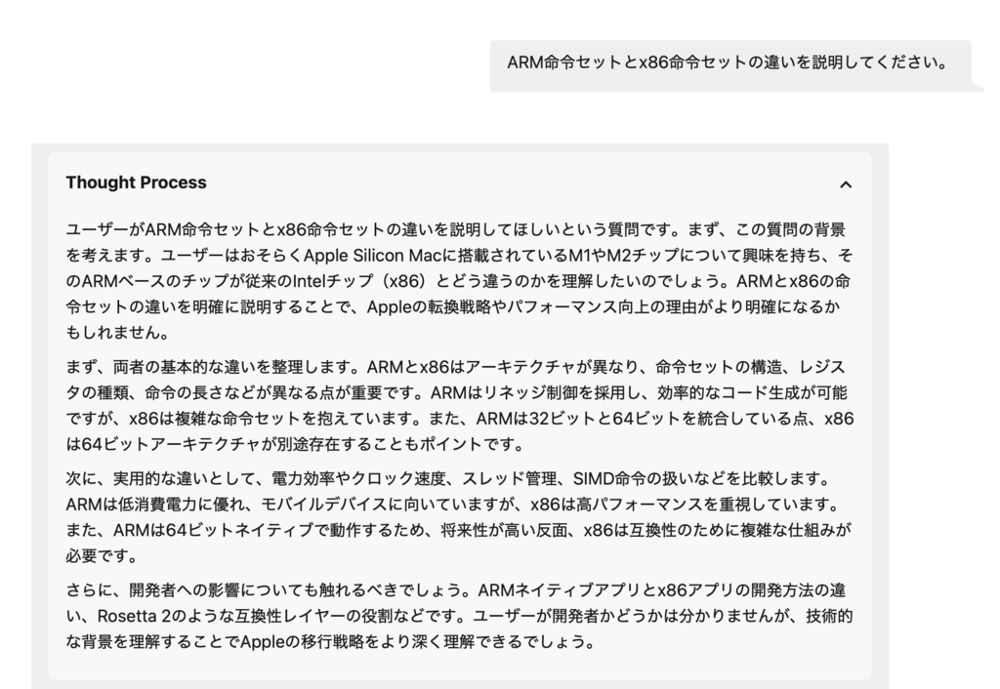
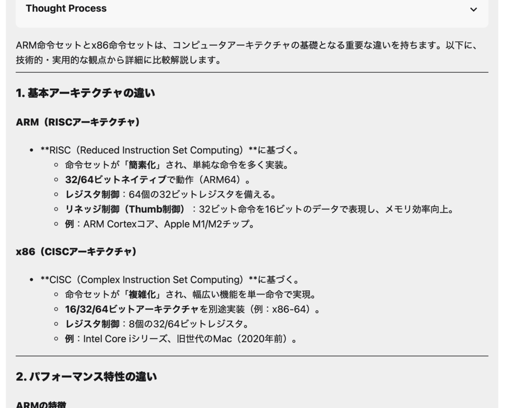
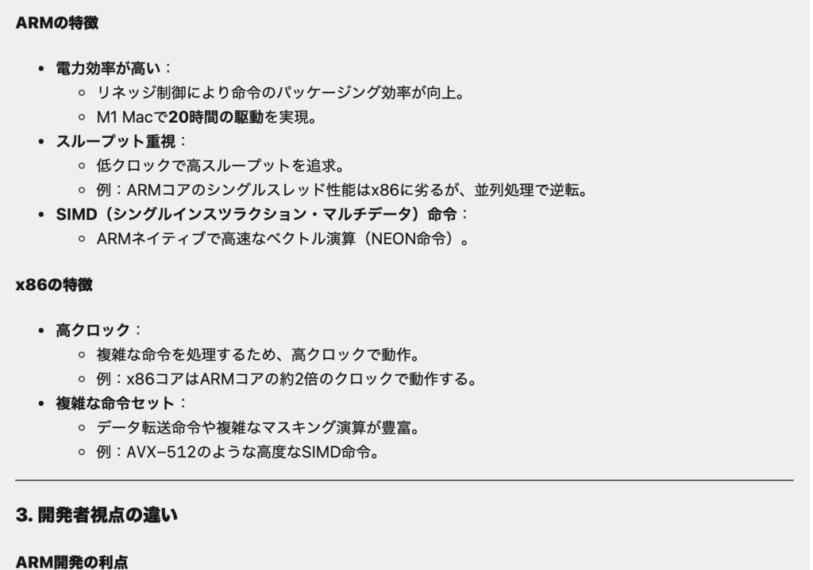


おかしいところもありますが、AI に思考プロセスを示させて
深く考えさせることで、AI をより適切に利用できると思います。

### 終了方法

Safari を閉じて llama.cpp のターミナルを閉じてください。


