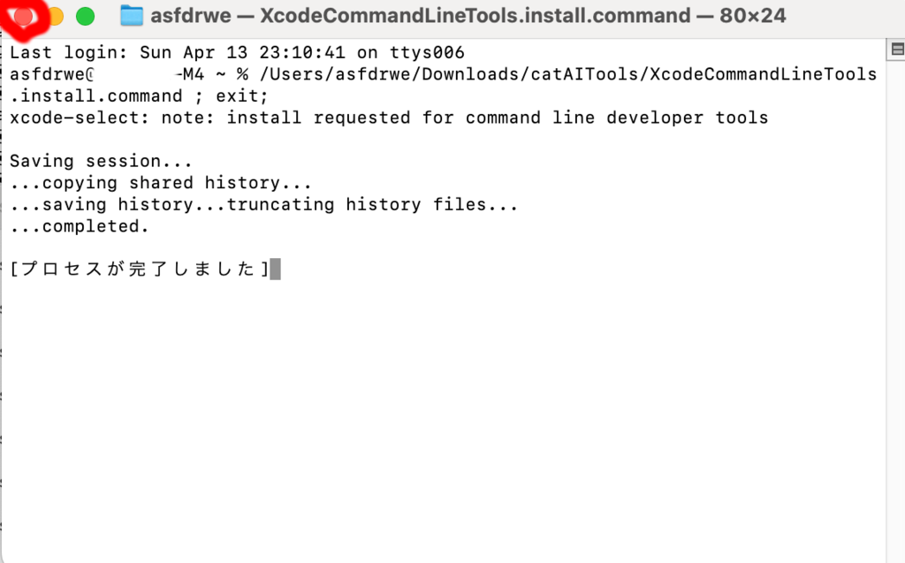

## catAIToolsのダウンロード
Apple Silicon Mac 向けのユーティリティを作成しました。
最初に[こちら]()からダウンロードしてください。
ダウンロードした zip ファイルは自動的に展開されてダウンロードフォルダに
catAITools フォルダができているはずです。

## セキュリティ処理
現在 macOS ではセキュリティ強化のため、原則 Apple が問題ないか検証したものだけ
実行できるようになっています。

Apple Store からインストールしたもののみ実行可能にしてそれ以外からの実行を禁止できますし、
Apple Store 以外から実行できる設定にした場合も、アプリ開発者が Developer Programに
登録し、取得した証明書でアプリに署名し、Apple にアプリを提出して検査を受ける
[公証](https://developer.apple.com/jp/developer-id/)という手続きを経ないと、
[GateKeeper(門番)](https://support.apple.com/ja-jp/guide/security/sec5599b66df/web)
がプログラムの実行を防止します。

ネットから Safari や Google Chrome でダウンロードすると、ダウンロードした
ファイルに自動的に com.apple.quarantine 拡張属性が付与されます。
com.apple.quarantine が付いたファイルやそのファイルに由来するファイルを
実行しようとすると、GateKeeper が自動的に安全性をチェックする仕組みになっています。

署名に必要な Developer Program の参加には費用がかかり、プログラムに対する署名や
公証には色々な作業が必要です。

こちらが用意したスクリプトは公証されていないので、そのままでは実行できません。

[こちら](https://qiita.com/daidara_bo/items/3107c4ded07ef9d43a5a)を参考に、
拡張属性をすべて削除して GateKeeper を回避できるようにするクイックアクションを
用意しました。

Finder でダウンロードフォルダを開き、中にある catAITools フォルダを開いてください。

『拡張属性削除.workflow』をダブルクリックしてください。

インストールを押してインストールしてください。

Finder で適当なファイルやフォルダの上で右クリックするとコンテキストメニューの
クイックアクションの中に拡張属性削除というメニューが追加されているはずです。
ダウンロードしたアプリに対してこれを選べば GateKeeper を無視して実行できるようになります。

ダウンロードフォルダに戻ってください。

catAITools フォルダの上で右クリックしてクイックアクションの
拡張属性削除を選んでください。

これでこちらの用意したユーティリティが動作するようになります。

操作方法がわかっていればこのクイックアクションを使用しなくても
公証されていないものを実行できますが、macOS 15 Sequoia から
その操作方法がややこしくなっています。
[こちら](https://support.apple.com/ja-jp/102445)に
解説が書かれているのでこれに従って実行可能にしても OK です

セキュリティ上あまり好ましくないことを行っているので、正しいファイルか
確認の上、気をつけて実行してください。

## Xcode Command Line Toolsのインストール

この文書で解説するプログラムを実行するためには、git や python などさまざまな
開発用ツールが必要となります。Xcode Command Line Tools をインストールすることで
必要なツールがインストールされます。

catAITools フォルダを開き、『XcodeCommandLineTools.install.command』を
ダブルクリックしてください。

Xcode Command Line Tools がインストールされていない場合、指示に従い利用規約に
同意してインストールしてください。

インストールが完了したらそのままウィンドウを閉じてください
(インストール済みの場合は何も起こらずプログラム が終了するので、そのまま
ウィンドウを閉じてください）。
