## 動画生成AI

動画生成 AI では画像生成 AI と同じ ComfyUI Desktop を利用します。
まだインストールしていない場合は、[画像生成のインストール](image-install.md)
に従って、ComfyUI Desktop をインストールしてください。

## 推奨モデルのダウンロード
ComfyUI Desktop を起動している場合は、一旦を終了してください。

catAITools フォルダの ComfyUI用ツールフォルダに推奨モデルを
ダウンロードする『VideoModel.download.command』を用意しました。
これをダブルクリックしてください。

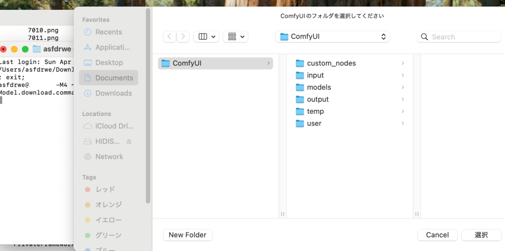

ComfyUIフォルダを指定し、

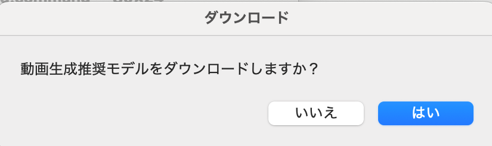

はいを押せば、次の推奨モデルがダウンロードされます。
数十GBあるのでストレージ容量に気をつけてください。

HunyuanVideo用(7種類)

  - hunyuan-video-t2v-720p-Q4_K_M.gguf
  - hunyuan-video-i2v-720p-Q4_K_M.gguf
  - hyvideo_FastVideo_LoRA-fp8.safetensors
  - clip_l.safetensors
  - llava_llama3_vision.safetensors
  - llava-llama-3-8b-v1_1.Q4_K_M.gguf
  - hunyuan_video_vae_bf16.safetensors


WanVideo用(5種類)

  - wan2.1-t2v-14b-Q4_K_M.gguf
  - wan2.1-i2v-14b-480p-Q4_K_M.gguf
  - umt5-xxl-encoder-Q4_K_M.gguf
  - clip_vision_h.safetensors
  - wan_2.1_vae.safetensors

MMAudio用(4種類)

  - apple_DFN5B-CLIP-ViT-H-14-384_fp16.safetensors
  - mmaudio_large_44k_v2_fp16.safetensors
  - mmaudio_synchformer_fp16.safetensors
  -  mmaudio_vae_44k_fp16.safetensors

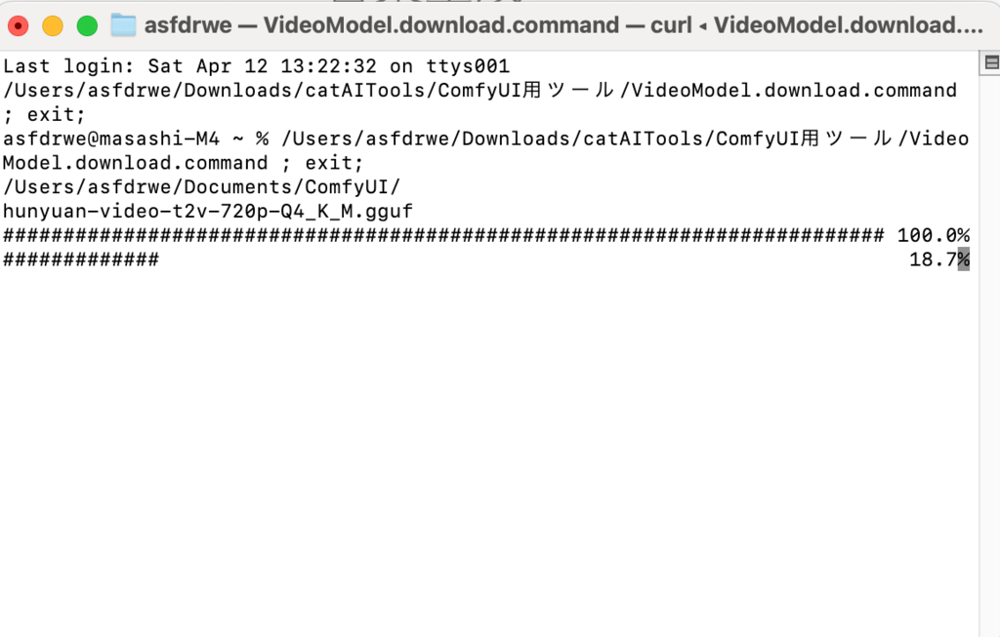
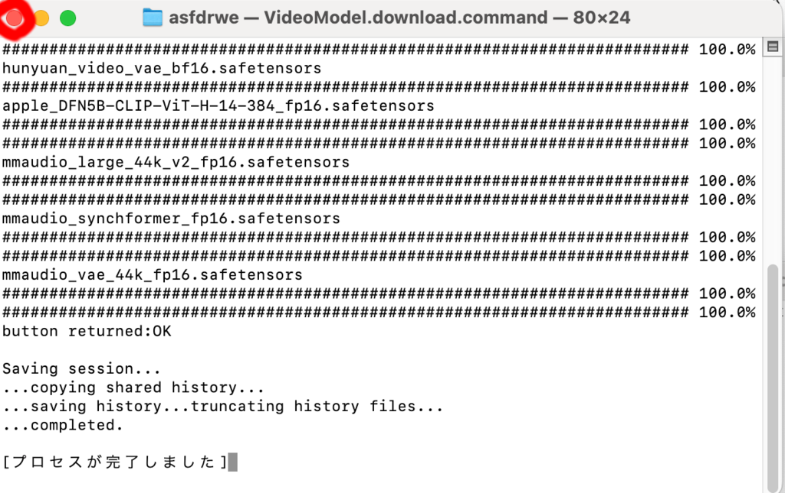

ダウンロード完了するとダイアログが表示されるので、
OKを押してターミナルを閉じてください。

ComfyUI Desktop を起動してください。

## HunyuanVideoでの文章に基づく動画生成

まず手始めに文章(Text)から動画(Video)を生成していきます。 
Text to Video(T2V)といいます。

『3.1.1.HUNYUAN動画生成T2V.json』を開いてください。

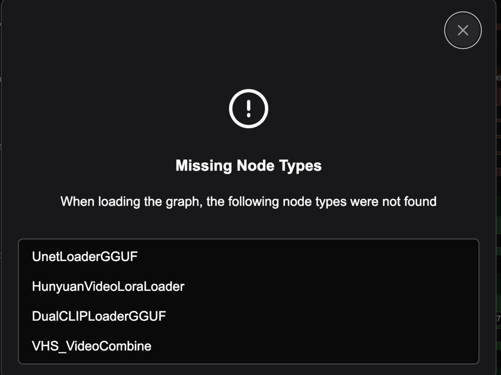

ComfyUI-GGUF(GGUF 形式のモデルを扱う) と VideoHelperSuite(動画を扱う) と
ComfyUI-HunyuanVideoMultiLora (HunyuanVideo 用にカスタマイズされた LoRA ローダ)
の 3 つのカスタムノードが必要です。


右上の Manager から ComfyUI-Manager を起動し、Install Missing Custom Nodesを押し、

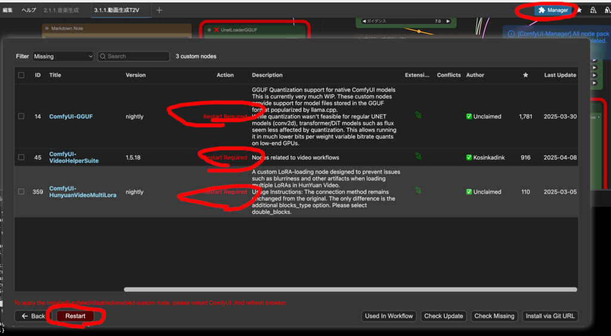

3つともインストールしてください。
まとめてインストールして Restart して問題ないです。

HunyuanVideo での動画生成は画像生成と基本的には同じですが、
プロンプトは基本的には英語の文章で記述します。

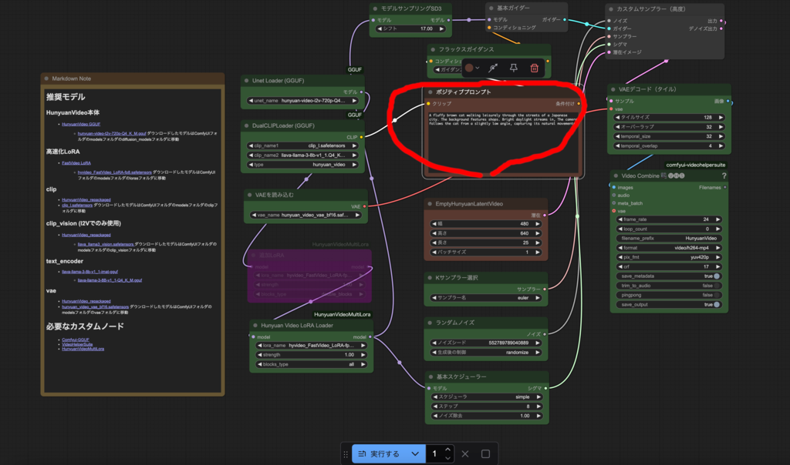

ポジティブプロンプトに次の文章を入力して実行するを押してください。

```
A fluffy brown cat walking leisurely through the streets of a Japanese city. 
The background features shops. Bright daylight streams in, 
The camera follows the cat from a slightly low angle, 
capturing its natural movements.
```

20分程度で猫が街中を歩いているリアル調の1秒程度の動画が生成されたと思います。

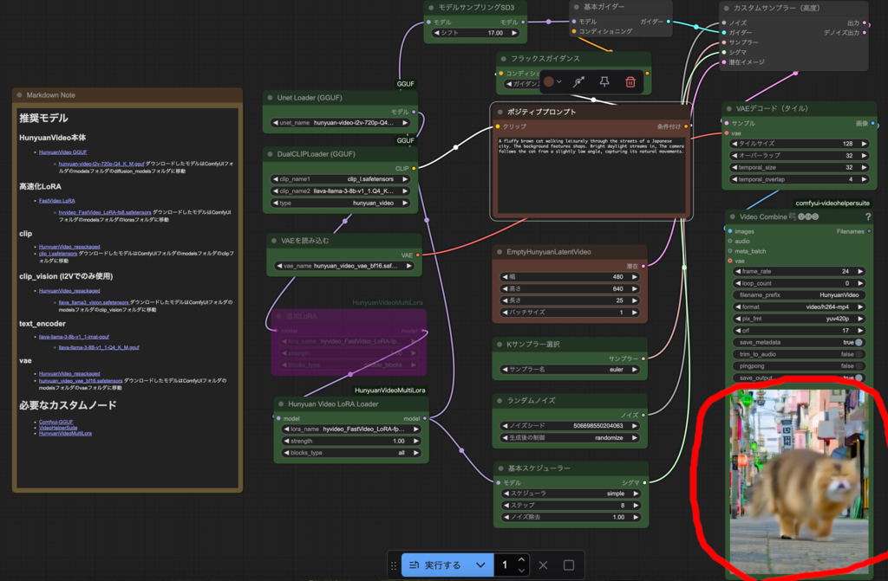


### ノード解説
- ポジティブプロンプト

生成する動画への指示を英文で書いてください。HunyuanVideo では
ネガティブプロンプトはないので表現したい要素をポジティブプロンプトに書いてください。

- EmptyHunyuanLatentVideo

動画の幅や高さやフレーム数(HunyuanVideo では1秒間24フレームなので25フレームで
1秒強)を指定してください。秒数を増やせば生成時間はかなり増えます。

- 基本スケジューラー

ステップ数を増やすと画質が向上しますが時間がかかります。
高速化 LoRA の仕様では 6 ステップで可能となっていますが、
6 ステップではいまいちな気がしたので、8ステップにしています。

- フラックスガイダンス

プロンプトが動画に与える影響度です。増やすとプロンプトの内容に
より近づきますが破綻しやすくなります。

- モデルサンプリングSD3
- VAEデコード（タイル）

変更すると動画の動き具合は変わるはずですが、通常変更する必要はありません。

- Video Combine VHS

format で h264 や h265 など動画のコーディックの変更が可能です。
h264-mp4 の場合 crf が動画の品質です。loop_count を増やすと
その回数分ループする動画が生成されます。

- Unet Loader(GGUF)
- DualCLIPLoader(GGUF)
- VAEを読み込む

GGUF 形式のモデルを使用しています。GGUF 形式はモデルを量子化したものです。
JPEG画像やMPEG動画のように、モデルの精度が落ちる代わりにモデルサイズを
縮小する非可逆圧縮を行ったものと捉えてよいです（正確には違いますが）。 
16GB のメモリでも動作するよう GGUF 形式の Q4_K_M という量子化モデルを使用しています。

- Hunyuan Video Lora Loader

高速化 LoRA を読み込みます。通常は変更する必要はありません。

- 追加 LoRA

LoRA を使用したい場合は有効にして使いたい LoRA を指定してください。
blocks_type は double_blocks にしないと複数 LoRA を重ねたときに品質が低下
しやすくなります。

### 日本語でのプロンプト
[Google 翻訳](https://translate.google.com/?sl=auto&tl=ja&op=translate)や
[DeepL](https://www.deepl.com/ja/translator)などで日本語文章を翻訳するか、
後述する[言語 AI](language.md) に英文プロンプトを作成してもらうのがよいと思います。

## HunyuanVideo での画像に基づく動画生成

画像を元に画像を生成する I2I と同様に、動画の一番最初となる画像を与えて、
その画像(Image)に対する動画(Video)を生成する Image to Video(I2V) も可能です。

『3.1.2.HUNYUAN動画生成I2V.json』を開いてください。

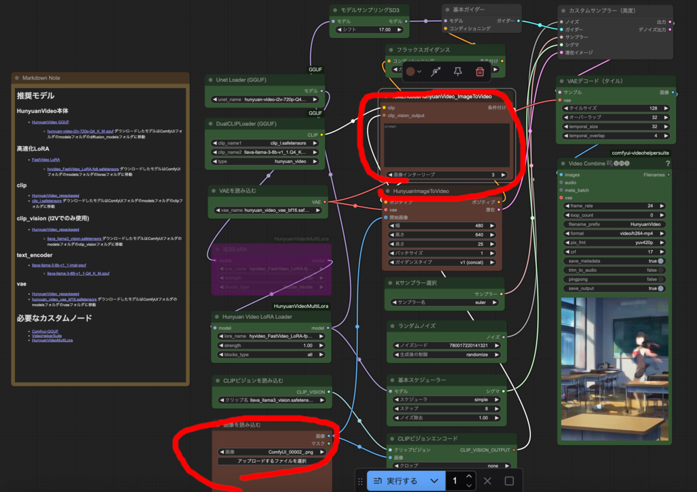

『1.1.1.画像生成基本T2I.json』で生成した猫画像を『画像を読み込む』ノードで選択してください。

ポジティブプロンプトに次の文章を入力して実行するを押してください。

```
A cat walking leisurely through in bedroom. 
The background features bed. Bright daylight streams in, 
The camera follows the cat from a slightly low angle, 
capturing its natural movements.
```

元絵からだいぶ離れている気がしますが猫が寝室を動いている動画が生成されます。


基本的には T2V で動画を作成するより、画像を生成した上で I2V で動画にする方が
求める動画を作りやすいと思います。

## Wan2.1 での文章に基づく動画生成

Wan2.1 による T2V 動画生成を行います。HunyuanVideo より高品質ですが、
M4 Mac mini の GPU や 16GB のメモリでは性能的に厳しいので、
240x320 の小サイズの 1 秒程度の動画を生成します。 

『3.2.1.Wan動画生成T2V.json』を開いてください。

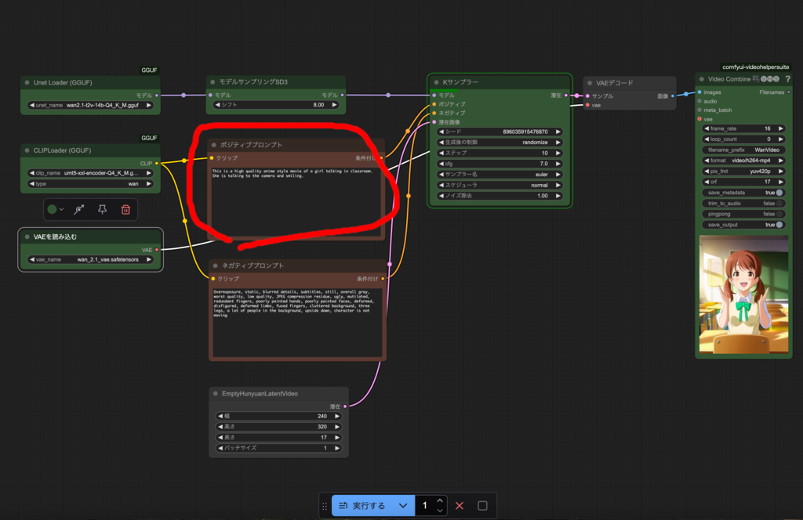

次のプロンプトをポジティブプロンプトに入れて実行するを押してください。

```
This is a high quality anime style movie of a girl talking in classroom.
She is talking to the camera and smiling.
```

15 分程度で少女がこちらに話しかけてるアニメ調の 1 秒の動画が生成されるはずです。


### ノードの説明

- ポジティブプロンプト
- ネガティブプロンプト

画像生成と同様に動画に対する指示をポジティブプロンプトに書き、動画に
含めたくないものをネガティブプロンプトに書いてください。

- EmptyHunyuanLatentVideo

幅や高さや長さを指定します。Wan2.1 は 1 秒間に 16 フレーム(16fps)なので、
17 フレームで 1 秒強の動画になります。

- Kサンプラー

T2V ではステップ数を 10 にしています。本来は 20〜30 必要なのですが、
生成速度を上げるために少ないステップ数にしています。

## Wan2.1 での画像に基づく動画生成

画像を与えてその画像に対する動画を生成します。

『3.2.2.Wan動画生成I2V.json』を開いてください。

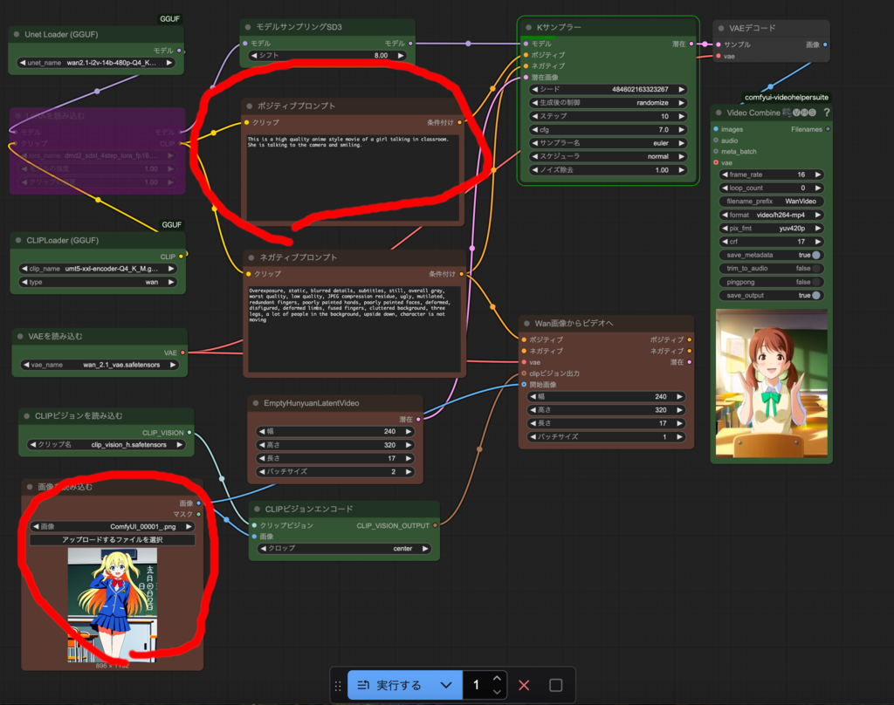

画像生成で生成した少女の画像を『画像を読み込み』で選択し、
次のプロンプトをポジティブプロンプトに入れて実行するを押してください。

```
This is a high quality anime style movie of a girl talking in classroom.
She is talking to the camera and smiling.
```

I2V では同じステップ数でも 2 倍以上時間がかかる上に
品質の問題からステップ数を 20 にしているので、60 分程度かかります。

元画像に基づくこちらに話しかけてるアニメ調の 1 秒の動画が生成されるはずです。


### ノードの解説

- CLIPビジョンエンコード

画像と動画の縦横比率がが違う場合にどう切り抜くかの指定ができます。
none なら何もしません。center にすると画像の中心部分を切り抜いて
動画の比率に合わせます。

## Wan2.1 での開始画像と終了画像に基づく動画生成
開始画像だけでなく終了画像も与えることでより求める動画を生成しやすくなります。

ComfyUI-WanStartEndFramesNativeと いうカスタムノードを使用します。

ただ、このノードでは幅や高さが 320 未満のものを生成できないので、
240x320 の動画が生成できるようパッチを当てながらインストールします。

一旦 ComfyUI Destkop を終了し、catAITools フォルダの ComfyUI 用ツールフォルダの
『ComfyUI-WanStartEndFramesNative.install.command』をダブルクリックしてください。

ComfyUI フォルダを選択してインストールしてください。

ComfyUI Desktop を起動し、『3.2.3.Wan動画生成開始終了画像指定I2V.json』を開いてください。

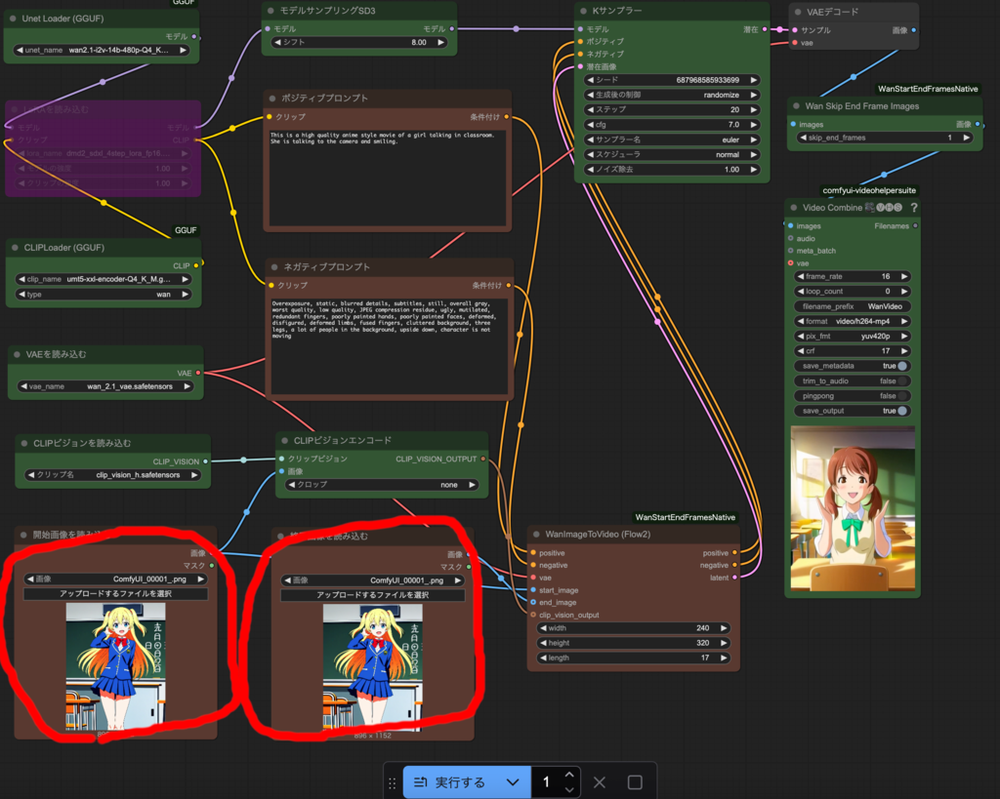

画像生成で生成した少女の画像を『開始画像を読み込み』で選択し、
同じ画像を『終了画像を読み込み』でも選択します。
こうすることでループする動画を容易に作成できます。

この場合、開始画像と終了画像が同じなので、終了画像は
動画から取り除きます。『Wan Skip End Frame Images』ノード で
skip_end_frames を 1 にすることでその処理を行います。

『Video Combine VHS』ノードの loop_count を 5 にすることで
1 秒の動画を 5 回繰り返して 5 秒の動画を作成します。

次のプロンプトをポジティブプロンプトに入れて実行するを押してください。

```
This is a high quality anime style movie of a girl talking in classroom.
She is talking to the camera and smiling.
```


## Wan2.1 1.3B InPでの開始画像と終了画像に基づく動画生成(2025/5/7追加)
少ないメモリで高速に動画生成できるWan2.1 1.3B InPモデルを使って動画生成します。

一旦 ComfyUI Destkop を終了し、catAITools フォルダの ComfyUI 用ツールフォルダの
catAITools フォルダの ComfyUI用ツールフォルダの『WanInP.Model.download.command』を
ダブルクリックしてください。

ComfyUIフォルダを指定し、はいを押せば、次のモデルがダウンロードされます。

  - wan2.1-1.3b-InP.safetensors
  - Wan2.1_VAE.pth

ComfyUI Desktop を起動し、『3.2.4.WanInP動画生成開始終了画像指定I2V.json』を開いてください。

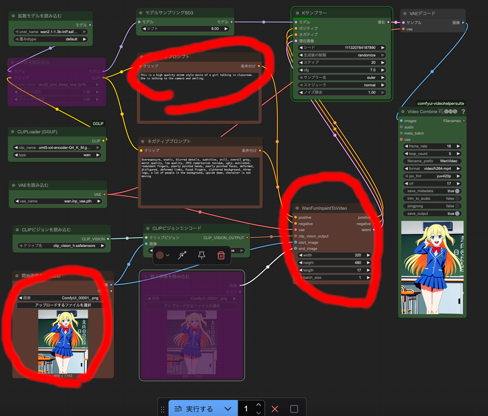

画像生成で生成した少女の画像を『開始画像を読み込み』で選択し、同じ画像を『終了画像を読み込み』でも選択します。
(上の画像では間違って終了画像が無効になっていますが無効にせず生成してください。無効にした方が動きは強くなります)。

次のプロンプトをポジティブプロンプトに入れて実行するを押してください。

```
This is a high quality anime style movie of a girl talking in classroom.
```

5分程度で動画が生成されるはずです。あまり品質はよくないですが、非常に高速に動画が生成できます。


## AI活用動画加工

### 動画拡大

『1.4.1.画像2倍拡大.json』と同様の手法で動画を2倍に拡大します。

1.4.1.画像2倍拡大.json』で『ComfyUI.ESRGAN.fix.command』を実行して
 ComfyUI Desktop のコードを修正している場合はそのまま動きます。
修正していない場合は実行してください

『3.3.1.動画2倍拡大.json』を開いてください。


生成した猫の動画(480x640 24fps)を『Load Video(Upload)』ノードの choose video to upload
からアップロードしてください。

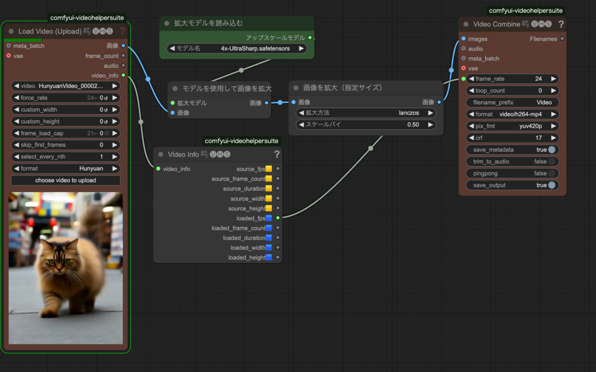

実行するを押すと 480x640 の動画を 2 倍の 960x1280 の動画に拡大できました。


『3.3.2.動画4倍拡大.json』を開いてください。こちらでは lanczos アルゴリズムで
半分にすることを行わないので、そのまま 4 倍に拡大されます。


同様に生成した少女の動画(240x320 16fps)を『Load Video(Upload)』ノードの 
choose video to upload からアップロードしてください。

240x320 の動画を 4 倍の 960x1280 の動画に拡大できました。


### フレーム補間

HunyuanVideo の生成動画はフィルム映画と同じ 1 秒間に 24 フレーム(24fps)ですが、
ディスプレイは 60fps や 120fps なのでカクついて見える場合があります。

AI を利用してフレーム補間することでより滑らかな動画にできます。

『3.3.3.動画フレーム補間.json』を開いてください。

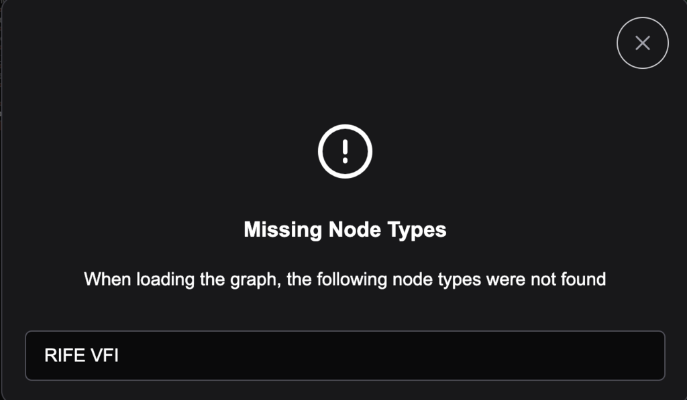

ComfyUI-Frame-Interpolation カスタムノードが必要です。
右上の Manager から ComfyUI-Manager を起動して
Install Missing Custom Nodes からインストールして、
Restart を押して ComfyUI Desktop を再起動してください。

必要なモデルは自動的にダウンロードされます。

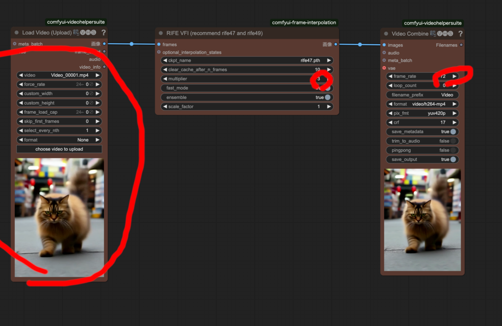

Load Video の choose Video to upload から先ほど拡大した HunyuanVideo 猫動画(24fps)をアップロードしてください。

『RIFE VFI』ノードの multiplier を 3、『Video Combine VHS』の 
frame_rate を 72 にして実行するを押してください。

3 倍の 72 fpsに補間されました。より滑らかになったはずです。


Load Video の choose Video to upload からWan少女動画(16fps)をアップロードしてください。

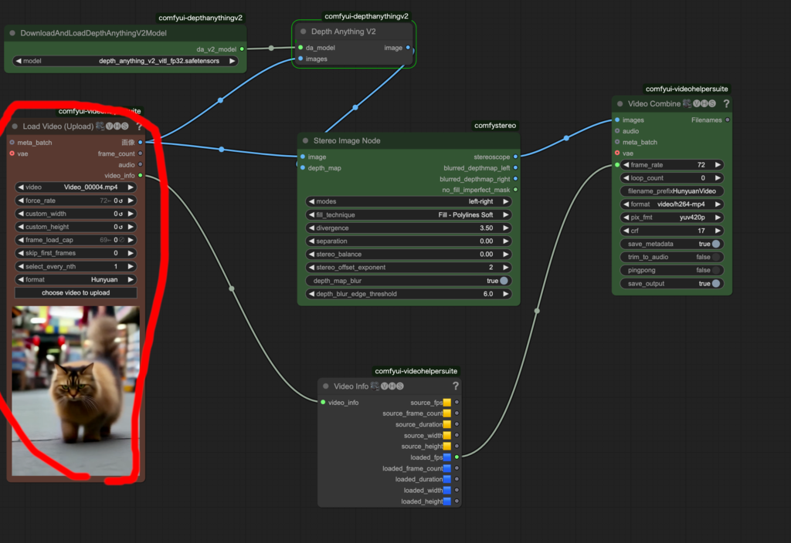

RIFE VFI ノードの multiplierを4、Video Combine VHSのframe_rateを64にして実行するを押してください。

4倍の64fpsに補間しています。より滑らかになったはずです。


### ステレオ動画化
VR向けにステレオ動画化します。

3.3.4.動画ステレオ化.jsonを開いてください。画像のステレオ化と同じカスタムノードが必要です。

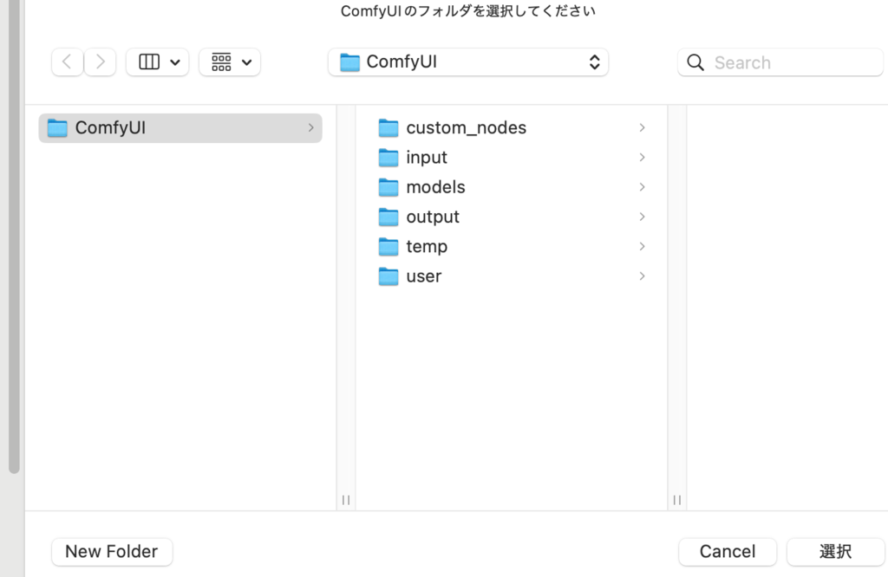

『Load Video』 の choose Video to upload から先ほどフレーム補間した猫動画をアップロードして実行するをおしてください。

平行法用LR形式のステレオ動画が生成されます。
VRビューア等で見てください。


### 動画に基づく音声・音楽生成

動画にあった内容の音声や音楽を自動的につけるAIがあります。

ComfyUI-MMAudio というカスタムノードを使用します。

ただ、カスタムノードの評価がされていない関係で、
ComfyUI-Manager ではそのままではセキュリティ上インストールできない上に、
他でも容易に動かせるにも関わらず NVIDIA の CUDA 専用になっているので、
macOS でも動作するよう修正しながらインストールするスクリプトを用意しました。

ComfyUI Destkop を一旦終了してください。

『ComfyUI用ツール』フォルダの『ComfyUI-MMAudio.install.command』 をダブルクリックしてください。


ComfyUI のフォルダを選択すれば、ComfyUI-MMAudio のダウンロードと
コード修正が行われます。

ComfyUI Desktop を起動し、
『3.3.5.動画の内容に対応する音声・音楽をつける.json』を開いてください。

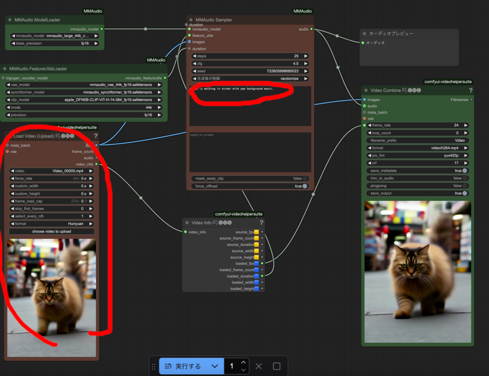

今までの動画はほとんど 1 秒だったので、10 回ループさせた 10 秒の
動画を用意しましょう。

一旦 『3.3.2.動画フレーム補間.json』ワークフローに戻り
『Video Combine VHS』ノードの loop_count を 10 に
してもう一度動画を生成してください。

生成できたら
『3.3.5.動画の内容に対応する音声・音楽をつける.json』のワークフローに
戻り、choose video to upload でアップロードしてください。

『MMAudio Sampler』ノードに次のプロンプトを入力して実行するを
押してください。

```
A cat is walking in street with pop background music.
```

歩いている猫にあったBGMが生成されるはずです。
右上のオーディオプレビューで生成音声が確認できます。

動画と音声を統合した動画はoutputフォルダから開いて
動画プレイヤーで再生してください。


