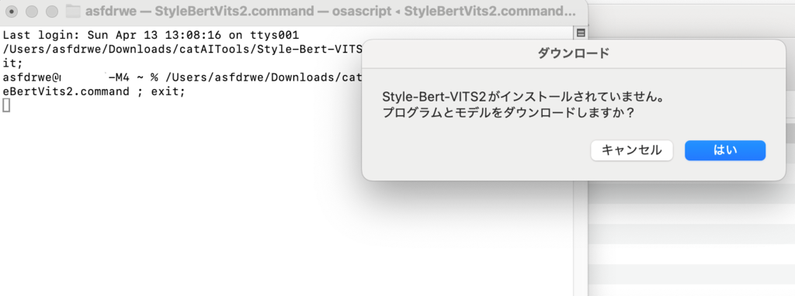
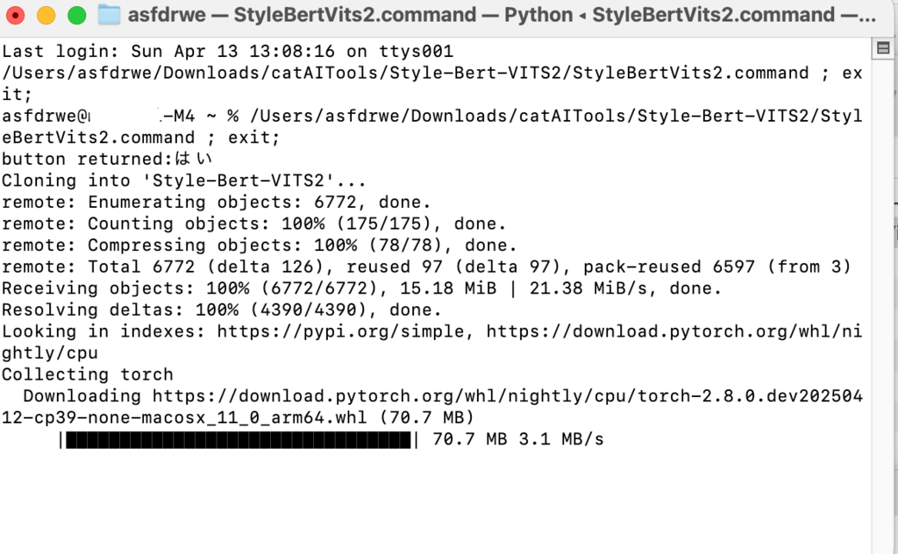
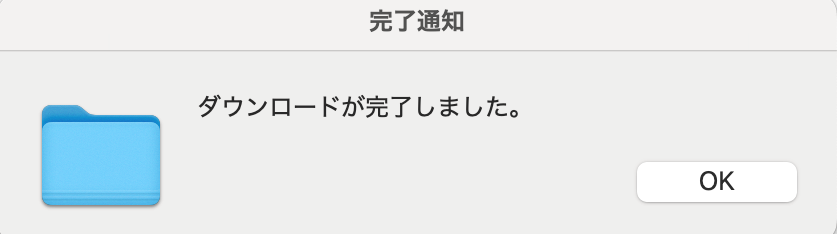
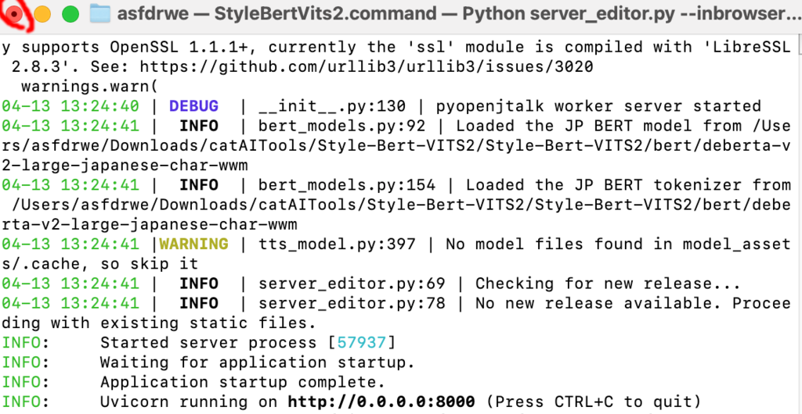
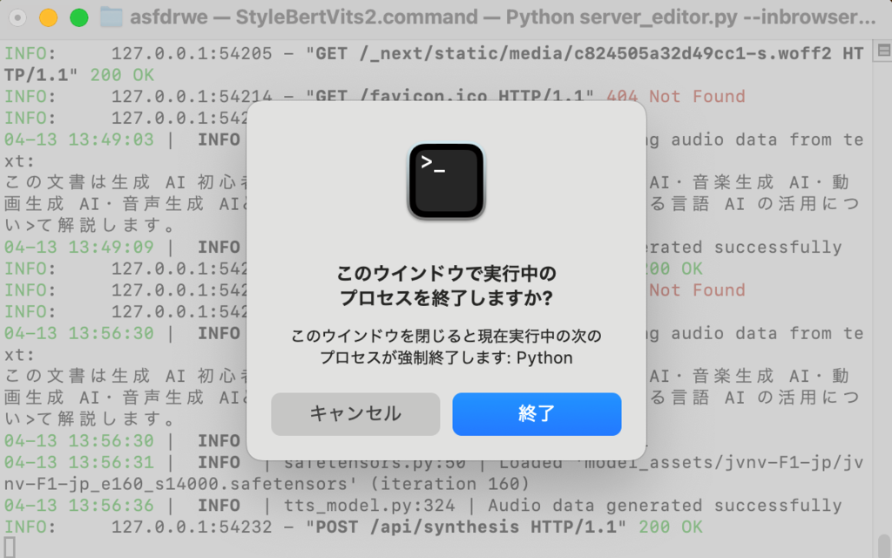
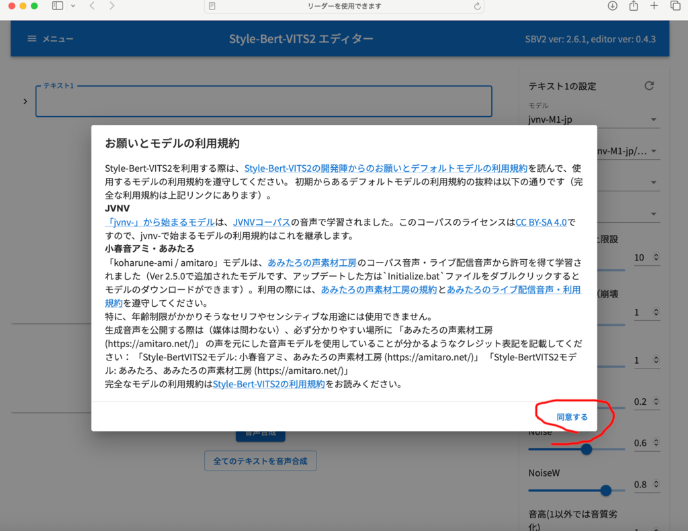
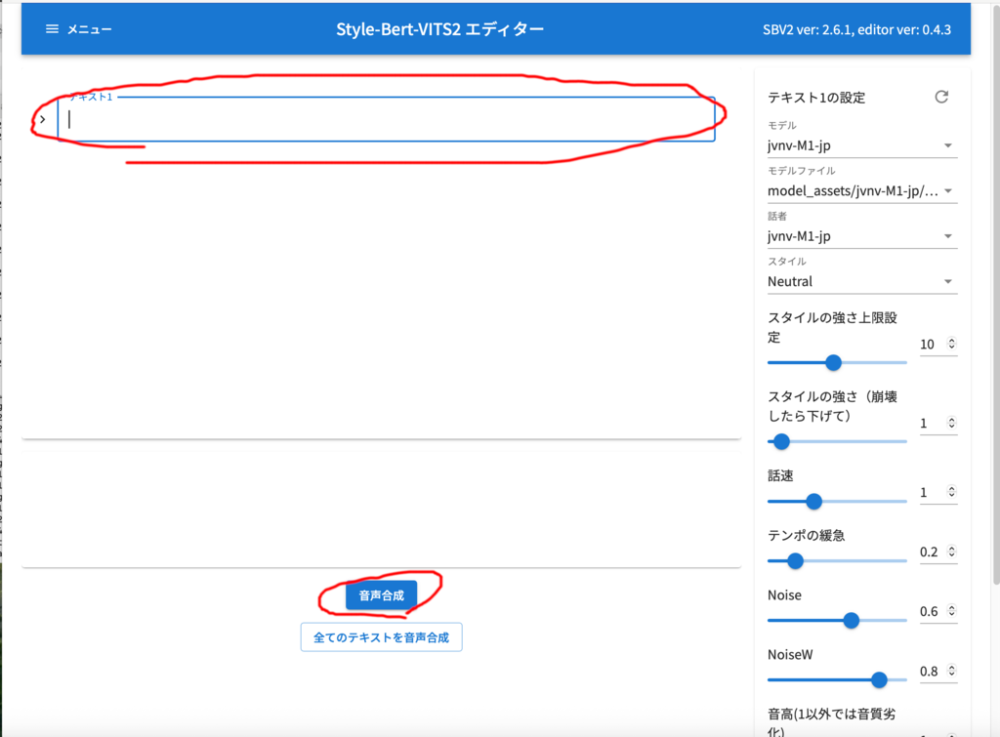
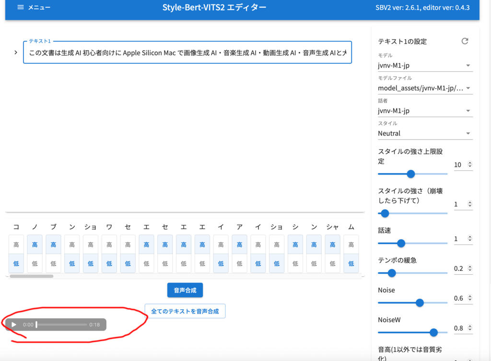
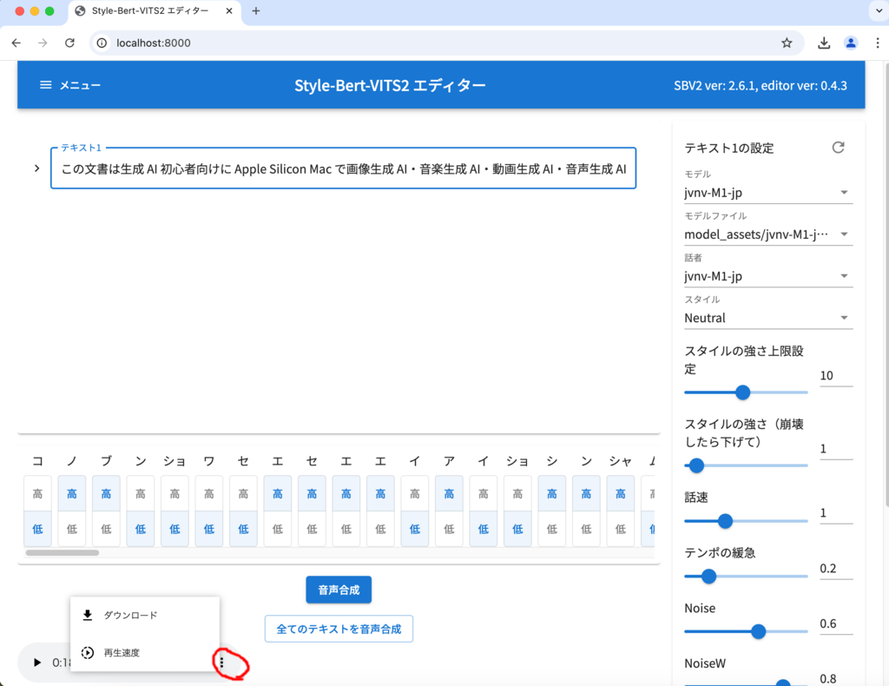
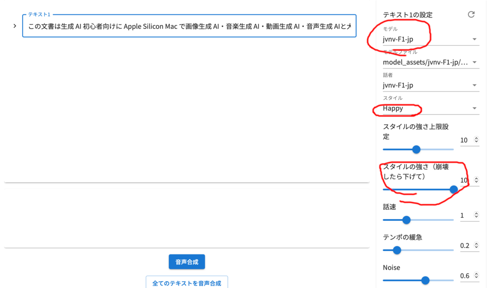

## 音声生成AI

[Style Bert VITS2](https://github.com/litagin02/Style-Bert-VITS2) を使用して音声生成 AI による文章からの音声合成を行います。

## Style Bert VITS2 のインストールと起動
catAITools フォルダにある Style-Bert-VITS2 フォルダを開き、
『StyleBertVits2.command』をダブルクリックしてください。



はいを押してください。Style-Bert-VITS2 フォルダの Style-Bert-VITS2 フォルダ
以下にプログラムをダウンロードし、続けてモデルをダウンロードします。




完了するとダイアログが出るので OK を押してください。




Styel-Bert-VITS2 が起動しますが、初回起動時はなにかおかしいようなので、
一旦終了してください。

### 注意事項
数 GB ダウンロードするので、通信データ量とストレージ容量に気をつけてください。

ストレージが少ない場合、『StyleBertVits2.command』を実行する前に
Style-Bert-VITS2 フォルダごと外付け SSD 等に移動させてから、
『StyleBertVits2.command』を実行してください。

あとから移動させると動かなくなるはずです。

## 文章を読み上げる音声生成
もう一度 StyleBertVits2.command を起動してください。



自動的に Safari が起動し、お願いとモデルの利用規約が表示されるので、よく読んで同意するを押してください。



テキスト1 に文章を入力して音声合成を押せば音声が生成されます。
次の文を入力して音声合成してください。

```
この文書は生成 AI 初心者向けに Apple Silicon Mac で画像生成 AI・音楽生成 AI・動画生成 AI・音声生成 AIと大規模言語モデルと視覚言語モデルによる言語 AI の活用について解説します。
```



左下から合成された音声を再生できます。


ただ、バグか仕様か分かりませんが、Safari では右クリックしても
生成した音声のダウンロードができないようなので、
代わりに Google Chrome や Firefox をインストールし起動して
[こちら](http://localhost:8080/)を開いて Chrome や Firefox で音声合成してください。



Chrome や Firefox なら生成した音声を保存できます。



右のメニューからモデルを変更できます。

- jvnv-M1-jp 日本人男性
- jvnv-M2-jp 日本人男性その2
- jvnv-F1-jp 日本人女性
- jvnv-F2-jp 日本人女性その2
- koharune-ami 日本人女性、使用条件を読んで音声合成してください。
- amitaro 日本人女性、使用条件を読んで音声合成してください。

スタイルで読み上げ時の感情を制御できます。
スタイルの強さで感情の強さを制御できます。

モデルを jvnv-F1-jp にしてスタイルを Happy にしてスタイルの強さを 10 にして
もう一度音声合成してください。
今度は女性が幸せそうに音声を読み上げてくれるはずです。


そのほか話速やテンポの緩急なども制御できるので試してみてください。

## 他のモデル
モデルは booth などで配布や販売されています。

- [booth](https://booth.pm/ja/search/style%20bert%20vits)

他にもモデルは配布されているようなので、『Style Bert Vits2 Model』等で
検索してみてください。

## 学習について
Style Bert VITS2 には[自分の声などを学習してモデルを作成する機能](https://github.com/litagin02/Style-Bert-VITS2/blob/master/docs/CLI.md)が
あります。`python app.py`で動くはずなのですが、
このスクリプトで使用している macOS Sequoia の Xcode 
Command Line Tools 付属のpython3.9 ではうまく動かないと思います。

brew 等で python3.10 を入れて動かせば動くと思いますが、この文書では説明しません。
